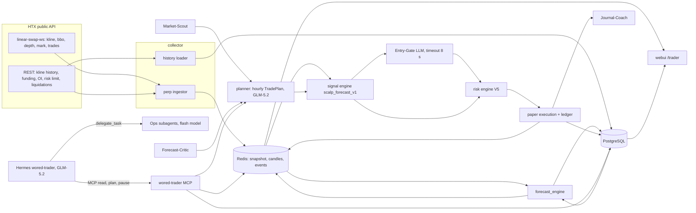

# ТЗ: WORED Trader Agent — прогноз и paper-торговля BTC-USDT perpetual с агентом-трейдером

`[STYLE: TECHNICAL]` — документ описывает системы, формулы, контракты данных и критерии приёмки для разработчиков, аналитиков и агентов-исполнителей; раздел 1 дан кратко для владельца продукта.

| Поле | Значение |
|---|---|
| Документ | `TZ_WORED_TRADER_AGENT_v0.1-0.md` / `TZ_WORED_TRADER_AGENT_v0.1-0.docx` |
| Макет UI | `UI_WORED_TRADER_MOCKUP_v0.1-0.html` |
| Версия | v0.1-0 (первая редакция) |
| Дата сверки источников | 16.09.2026 |
| Проект | WORED (`D:\WORED`), контур paper trading |
| Режим | Только симуляция. Реальные ордера запрещены (см. раздел 12) |
| Владелец | Бугор |
| Исполнители | Hermes Agent (оркестрация), QwenCode / Antigravity / Codex (реализация) |

## Содержание

1. Краткие выводы
2. Цель, границы и KPI
3. HTX API: что доступно и как использовать
4. Математика стратегии и баланс риска
5. Архитектура системы
6. Прогнозный движок
7. Агентная система: Hermes + субагенты
8. Модели, роутинг и бюджет
9. Web UI: экран торговли
10. Сценарии использования
11. Блоки реализации A–F и критерии приёмки
12. Запреты
13. ADR — архитектурные решения и связь с ТЗ 27.06.2026
14. Риски и открытые вопросы
15. Источники

## 1. Краткие выводы

1. **Публичные данные HTX доступны без ключа.** 16.09.2026 проверены живые ответы: тикер, книга (bid/ask), свечи 1m/60m, спецификация контракта, риск-лимиты V5. Для paper-торговли ключ не нужен.
2. **Приватного API-ключа HTX в WORED нет.** В `.env` отсутствуют `HTX_ACCESS_KEY`/`HTX_SECRET_KEY` (проверено по именам переменных, значения не читались). Для будущей синхронизации аккаунта нужен ключ с правом Read и привязкой к IP.
3. **HTX переводит приватный API USDT-M на V5. Дедлайн — 19.09.2026 16:00 UTC.** Старые приватные эндпоинты перестанут работать. Рыночные эндпоинты не меняются. Эндпоинт `swap_adjustfactor` (старая модель ликвидации) не имеет аналога в V5.
4. **Модель ликвидации изменилась.** Новая формула для изолированной маржи: ликвидация, когда `N_mark × (MMR + taker_fee) ≥ маржа позиции + uPnL`. Для BTC-USDT уровень 1: плечо до 200x, MMR = 0.0028. Текущий `paper_trading/risk.py` использует фиксированный MMR 0.005 и формулу `1/L − MMR`: при 200x он даёт ликвидацию в точке входа. Это нужно исправить до любых тестов 100–200x.
5. **Доливка маржи поддерживается:** `POST /v5/position/margin` (`type=add|reduce`, сумма в USDT). В paper-контуре это отдельная проводка ledger.
6. **Без предсказательного преимущества (edge) стратегия убыточна при любом плече.** На 30 днях минутных свечей HTX при случайном направлении EV сделки = −(комиссии круга): −$0.96 при 100x и −$1.92 при 200x. Схема «TP = комиссии + $0.5, выход только по ликвидации» требует точности ≥ 94–96%. Рабочий диапазон — 50–100x с явным SL и TP ≥ 0.6%: требуемая точность 60%.
7. **LLM не должна стоять в горячем контуре.** Дистанция ликвидации при 200x — 0.16% (≈ $121). Цена проходит её за минуты. Сигналы, риск и исполнение — детерминированный Python. LLM задаёт часовой план, проверяет сигналы и разбирает сделки.
8. **Рекомендуемый набор моделей укладывается в Ollama Pro.** Расчётный расход ≈ $24/мес по тарифам кредитов Ollama (×2 запас на reasoning-токены ≈ $48 при лимите $60). GLM-5.2 — оркестратор; субагенты — `deepseek-v4.1-flash`, `minimax-m2.7`, `glm-5.3-flash`.

## 2. Цель, границы и KPI

### 2.1 Цель

Построить на базе WORED инструмент, который:

- прогнозирует следующую часовую свечу BTC-USDT perpetual (OHLC с диапазоном) и значения индикаторов на час вперёд;
- автоматически ведёт paper-торговлю в обе стороны (long/short) с разворотом позиции, рыночными ордерами, изолированной маржой и плечом до 200x;
- управляется агентом-трейдером на GLM-5.2 через Hermes, который делегирует оперативные задачи субагентам;
- показывает всё в Web UI в стиле биржевого терминала: история слева, текущая свеча в центре, прогнозные свечи справа, индикаторы, позиции с фильтрами.

### 2.2 Границы (scope)

| В scope v0.1 | Вне scope v0.1 |
|---|---|
| BTC-USDT perpetual, изолированная маржа, one-way режим | Другие контракты, cross margin, hedge mode |
| Рыночные ордера (taker), опционально post-only вход как эксперимент | Реальные ордера на HTX |
| Таймфрейм графика 1h; исполнение по тикам/1m | Автоподбор таймфрейма |
| Paper-счёт `auto` (агент) и `manual` (пользователь) | Копитрейдинг, боты сетки |
| Прогноз свечи и индикаторов на 1–3 часа | Прогноз на сутки и дольше |
| Hermes profile `wored-trader` | Изменение текущего Hermes profile WORED |

### 2.3 KPI

| KPI | Формула | Цель для перехода из «эксперимент» в «кандидат» |
|---|---|---|
| Net PnL paper | Σ(gross PnL − комиссии − funding) по счёту `auto` | > 0 за 30 дней, нижняя граница 95% CI > 0 |
| Самоокупаемость | Net PnL paper − расход LLM за период | ≥ 0 за 30 дней |
| Win rate с учётом профиля | wins / (wins + losses) | ≥ p_required профиля + 3 п.п. (раздел 4.7) |
| Доля ликвидаций | liquidated / closed | ≤ 2% |
| Max drawdown | max пик-к-дну equity счёта `auto` | ≤ 25% стартового баланса |
| Точность направления прогноза | доля часов, где знак (close − open) угадан | ≥ 55% на walk-forward, лучше случайного блуждания |
| Покрытие диапазона | доля часов, где фактические high/low внутри прогнозного 80%-диапазона | 75–85% |
| Свежесть данных | возраст снапшота perpetual | ≤ 5 с в 99% времени |
| Стоимость LLM | Σ токенов × тариф модели | ≤ $30/мес (профиль Economy) |

Точка самоокупаемости по LLM: $24/мес = $0.80/день. Это 1.6 сделки по +$0.5 сверх нулевого результата в день.

## 3. HTX API: что доступно и как использовать

### 3.1 Статус доступа

| Вопрос | Ответ (16.09.2026) | Как проверено |
|---|---|---|
| Публичные рыночные данные | Доступны, ключ не нужен | Живые ответы `detail/merged`, `history/kline`, `swap_contract_info`, `/v5/market/risk/limit` |
| Приватный API в WORED | Не настроен | В `.env` нет `HTX_ACCESS_KEY`/`HTX_SECRET_KEY` (проверка только имён) |
| Сетевой доступ из песочницы Cowork к `api.hbdm.com` | Заблокирован egress-политикой | `curl` вернул 403 от прокси. На хосте WORED доступ есть: collector уже публикует снапшоты |
| Версия приватного API | V5 обязательна после 19.09.2026 16:00 UTC | Объявление HTX от 03.09.2026 |

### 3.2 Адреса

| Назначение | Адрес |
|---|---|
| REST | `https://api.hbdm.com` (AWS: `https://api.hbdm.vn`; отладка: `https://api.btcgateway.pro`) |
| WS рыночные данные | `wss://api.hbdm.com/linear-swap-ws` |
| WS приватные (ордера, позиции) | `wss://api.hbdm.com/linear-swap-notification` |
| WS индекс и базис | `wss://api.hbdm.com/ws_index` |
| WS статус системы | `wss://api.hbdm.com/center-notification` |
| Архив свечей и сделок | `https://futures.huobi.com/data/klines/linear-swap/{daily или monthly}/{symbol}/{period}/{file}` (проверить доступность перед использованием) |

Все WS-сообщения сжаты GZIP. Сервер присылает `ping`, клиент отвечает `pong` с тем же значением.

### 3.3 Публичные REST-эндпоинты (без ключа)

TABLE: HTX public REST – copy to Sheets

| endpoint | данные | использование в системе |
|---|---|---|
| /linear-swap-ex/market/detail/merged | last, bid/ask с объёмом, OHLC 24h, объём | тикер, bid/ask для исполнения paper |
| /linear-swap-ex/market/bbo | лучший bid/ask | контроль спреда |
| /linear-swap-ex/market/depth | стакан (step0…step N) | оценка проскальзывания market-ордера |
| /linear-swap-ex/market/history/kline | свечи: 1min, 5min, 15min, 30min, 60min, 1hour, 4hour, 1day, 1mon; size 1–2000; from/to | история графика, фичи прогноза, бэктест |
| /linear-swap-ex/market/trade | последняя сделка | контроль свежести |
| /linear-swap-ex/market/history/trade | последние сделки | поток агрессора (buy/sell) |
| /index/market/history/linear_swap_mark_price_kline | свечи mark price | расчёт uPnL и ликвидации |
| /index/market/history/linear_swap_premium_index_kline | свечи premium index | фича: перекос perpetual к индексу |
| /index/market/history/linear_swap_estimated_funding_rate_kline | свечи оценки funding | фича и прогноз funding |
| /index/market/history/linear_swap_basis | базис | фича |
| /linear-swap-api/v1/swap_contract_info | contract_size, price_tick, статус, режимы маржи | спецификация контракта |
| /linear-swap-api/v1/swap_index | индексная цена | контроль расхождения |
| /linear-swap-api/v1/swap_funding_rate | текущая ставка funding | начисление funding в paper |
| /linear-swap-api/v1/swap_historical_funding_rate | история funding | бэктест |
| /linear-swap-api/v1/swap_open_interest | открытый интерес | фича |
| /linear-swap-api/v1/swap_his_open_interest | история OI | фича, бэктест |
| /linear-swap-api/v1/swap_elite_account_ratio | long/short топ-трейдеров по аккаунтам | фича настроений |
| /linear-swap-api/v1/swap_elite_position_ratio | long/short топ-трейдеров по позициям | фича настроений |
| /linear-swap-api/v1/swap_price_limit | ценовые лимиты | валидация цены |
| /linear-swap-api/v1/swap_api_state | доступность API | health |
| /linear-swap-api/v1/get_timestamp | время сервера | синхронизация часов |
| /v5/market/risk/limit | уровни риска: max_lever, maintenance_margin_rate, объём уровня | расчёт ликвидации в paper |
| /v5/market/funding_rate, /v5/market/funding_rate_history | funding (V5) | замена v1 после миграции |
| /v5/market/open_interest | OI (V5) | фича |
| /v5/market/liquidation_orders | ликвидации рынка; окно ≤ 2 ч за запрос, глубина 90 дней, до 100 записей | фича «каскад ликвидаций» |
| /v5/market/elite_account_ratio, /v5/market/elite_position_ratio | настроения (V5) | фича |

### 3.4 Публичные WS-топики

| Топик | Данные | Использование |
|---|---|---|
| `market.BTC-USDT.kline.1min` / `.60min` | свеча в реальном времени | текущая свеча на графике, триггеры |
| `market.BTC-USDT.depth.step0` / `depth.size_20.high_freq` | стакан | проскальзывание, дисбаланс книги |
| `market.BTC-USDT.bbo` | лучший bid/ask | исполнение paper |
| `market.BTC-USDT.trade.detail` | сделки | поток агрессора, VWAP |
| `market.BTC-USDT.detail` | сводка 24h | шапка UI |
| `market.BTC-USDT.mark_price.1min` | mark price | uPnL, ликвидация |
| `market.BTC-USDT.premium_index.1min`, `estimated_funding_rate.1min`, `basis.1min.open` | деривативный контекст | фичи |
| `public.BTC-USDT.funding_rate` | funding (без авторизации) | начисления |
| `public.BTC-USDT.liquidation_orders` | ликвидации | фича |
| `public.BTC-USDT.contract_info` | изменения спецификации | инвалидация кэша |

Лимиты WS: `req` — до 50 в секунду; `sub` — без лимита; не более 40 подписок в секунду на соединение.

### 3.5 Приватный API V5 (для будущей синхронизации и live)

Нужен ключ HTX. Права ключа: Read, Trade, Withdraw. Для этой системы допустим только Read. Ключ без привязки IP действует 90 дней. Подпись: `Ed25519` или `HmacSHA256`, `SignatureVersion=2`.

TABLE: HTX V5 private – copy to Sheets

| endpoint | метод | назначение | право |
|---|---|---|---|
| /v5/account/balance | GET | баланс и маржа | Read |
| /v5/account/asset_mode | GET/POST | режим обеспечения (1 = multi-asset, 2 = single-asset) | Read/Trade |
| /v5/account/bills | GET | финансовые записи | Read |
| /v5/trade/order | POST | ордер: margin_mode, position_side, side, type=market/limit/post_only, price_match, volume, reduce_only, TP/SL | Trade |
| /v5/trade/batch_orders | POST | пакет ордеров | Trade |
| /v5/trade/cancel_order, cancel_batch_orders, cancel_all_orders | POST | отмена | Trade |
| /v5/trade/position | POST | закрыть позицию по символу по рынку | Trade |
| /v5/trade/position_all | POST | закрыть все позиции | Trade |
| /v5/trade/order/opens, /order/details, /order/history, /order | GET | ордера и исполнения | Read |
| /v5/trade/cancel-after | POST | авто-отмена ордеров по таймеру (dead-man switch) | Trade |
| /v5/trade/position/opens | GET | позиции: open_avg_price, liquidation_price, initial_margin, maintenance_margin, margin_rate, profit_unreal, adl_risk_percent | Read |
| /v5/position/lever | GET/POST | список доступных плеч / установка плеча (в изолированной марже отдельно для long и short) | Read/Trade |
| /v5/position/mode | GET/POST | single_side (one-way) / dual_side (hedge); смена только без позиций и ордеров | Read/Trade |
| /v5/position/risk/limit, /risk/limit_tier | GET | риск-лимиты пользователя | Read |
| /v5/position/margin | POST | добавить или вывести маржу изолированной позиции: position_side, type=add/reduce, amount (USDT) | Trade |
| /v5/algo/order, cancel_orders, order/opens, order/history | POST/GET | TP/SL, trigger, trailing | Trade/Read |
| WS `orders.$contract_code`, `trade.$contract_code`, `positions.$contract_code`, `account`, `match_orders.$contract_code`, `algo_orders.$contract_code` | sub | приватные события | Read |

### 3.6 Спецификация BTC-USDT (живые данные 16.09.2026)

| Параметр | Значение | Источник |
|---|---|---|
| contract_size | 0.001 BTC | swap_contract_info |
| price_tick | 0.1 USDT | swap_contract_info |
| Период расчёта funding | 8 ч | swap_contract_info (`settlement_period`) |
| Режимы маржи | cross и isolated | swap_contract_info (`support_margin_mode=all`) |
| Максимальное плечо | 200x (уровень 1) | /v5/market/risk/limit |
| Last price (закрытие часа 14:00 UTC) | 75 540 USDT | history/kline 60min |
| Спред в момент проверки | 0.1 USDT (1 тик) | detail/merged |
| Комиссия maker / taker (Prime 0) | 0.02% / 0.06% | обзор тарифов HTX (май 2026); совпадает с `FEE_RATE=0.0006` в WORED. Уточнить по аккаунту после получения Read-ключа |

TABLE: HTX BTC-USDT isolated risk tiers – copy to Sheets

| tier | max_lever | maintenance_margin_rate | min_volume_usdt | max_volume_usdt |
|---|---|---|---|---|
| 1 | 200 | 0.0028 | 0 | 400000 |
| 2 | 175 | 0.003 | 400000 | 450000 |
| 3 | 150 | 0.0035 | 450000 | 500000 |
| 4 | 125 | 0.004 | 500000 | 600000 |
| 5 | 100 | 0.0055 | 600000 | 3600000 |
| 6 | 75 | 0.0067 | 3600000 | 8000000 |
| 7 | 50 | 0.008 | 8000000 | 10000000 |
| 8 | 30 | 0.0117 | 10000000 | 15000000 |
| 9 | 20 | 0.0125 | 15000000 | 20000000 |
| 10 | 10 | 0.0175 | 20000000 | 30000000 |
| 11 | 5 | 0.025 | 30000000 | 60000000 |

Позиция $400–$1 600 номинала всегда попадает в уровень 1. Таблицу кэшировать на 1 ч и перечитывать при событии `public.BTC-USDT.contract_info`.

### 3.7 Формулы маржи и ликвидации (новая система HTX)

Для изолированной маржи (single-asset collateral):

- `initial_margin = volume × contract_size × mark / leverage`
- `maintenance_margin = volume × contract_size × mark × (MMR_tier + taker_fee)`
- `maintenance_ratio = maintenance_margin / (position_margin + uPnL)`
- ликвидация при `maintenance_ratio ≥ 1`;
- `position_margin` включает добавленную маржу;
- uPnL изолированной позиции нельзя вывести или использовать для новых позиций;
- выводимая маржа: `position_margin + min(0, uPnL) − initial_margin`.

Старая модель (коэффициент корректировки `adjust_factor`, ликвидация при `equity / margin − adjust_factor ≤ 0`) для аккаунтов после миграции не действует. WORED не должен на неё опираться.

### 3.8 Лимиты и ограничения

| Ограничение | Значение |
|---|---|
| Приватный REST | 144 запроса / 3 с на UID (72 торговых + 72 чтения) |
| Публичные нерыночные запросы | 240 / 3 с на IP |
| Публичные рыночные REST | 800 / с на IP |
| Приватные WS | до 30 соединений на UID |
| Антиспам отмен | ≥ 3 000 ордеров за 10 мин и доля отмен > 99% → запрет limit/post_only/FOK/IOC на 5 мин; 3 запрета за час → 30 мин. Market-ордера под запрет не попадают |
| Режим позиции | один на аккаунт; смена только без позиций и ордеров |
| Смена плеча | разрешена при открытых ордерах; в изолированной марже отдельно для long и short |
| Ликвидации рынка (V5) | окно запроса ≤ 2 ч, глубина 90 дней, до 100 записей |
| `swap_adjustfactor` | удаляется, аналога в V5 нет |

### 3.9 Действия по WORED из-за миграции HTX

| Файл | Проблема | Действие |
|---|---|---|
| `collector/htx/perpetual_market.py` | Использует v1 рыночные эндпоинты | Рыночные эндпоинты не мигрируют. Изменений не требуется. Добавить публикацию `/v5/market/risk/limit` в снапшот |
| `paper_trading/risk.py` | `MMR=0.005` константой, формула `1/L − MMR` | Заменить на формулу 3.7 с тиром из `/v5/market/risk/limit` |
| `paper_trading/execution.py` | Плечо 1–100 в docstring, нет доливки маржи | Разрешить 1–200, добавить `adjust_margin` |
| `collector/indicators/calculator.py` | Индикаторы считаются по спотовым свечам (`api.huobi.pro`) | Для торговли использовать свечи perpetual (`linear-swap-ex`) |
| `.env.example` | `HTX_ACCESS_KEY`/`HTX_SECRET_KEY` без описания версии | Пометить: только V5, только Read, привязка к IP |

## 4. Математика стратегии и баланс риска

### 4.1 Обозначения

| Символ | Смысл | Значение по умолчанию |
|---|---|---|
| M | начальная маржа позиции, USDT | 8 |
| E | доливка маржи, USDT | 2 (не более одной) |
| L | плечо | 100–200 |
| N | номинал позиции, USDT: N = M × L | 800–1 600 |
| f_t | taker fee | 0.0006 |
| f_m | maker fee | 0.0002 |
| m | MMR уровня 1 | 0.0028 |
| T | минимальная чистая прибыль сделки, USDT | 0.5 |
| P | цена BTC | 75 540 |
| d | движение цены в долях | — |

### 4.2 Формулы

0. Объём в контрактах: `volume = floor(M × L / (P × 0.001))`; фактические N и M пересчитываются от volume. При P = 75 540 и M = 8: 100x → 10 контрактов (N = $755.4, M = $7.55); 200x → 21 контракт (N = $1 586.3, M = $7.93). Таблицы 4.3–4.7 используют N = M × L без округления; расхождение ≤ 6%.
1. Комиссии круга (вход и выход по рынку): `F = 2 × N × f_t`.
2. Минимальная дистанция TP для чистой прибыли T: `d_tp_min = 2 × f_t + T / N`.
3. Дистанция ликвидации (изолированная маржа, раздел 3.7): `d_liq = (M + E) / N − m − f_t`.
4. Цена ликвидации: long `P_liq = P_entry × (1 − d_liq)`; short `P_liq = P_entry × (1 + d_liq)`. Расчёт вести по mark price.
5. Потеря при ликвидации: `Loss_liq = M + E + N × f_t` (вся маржа и комиссия входа).
6. Сделка с SL на дистанции d_sl < d_liq: `Loss_sl = N × d_sl + F`; выигрыш на d_tp: `Win = N × d_tp − F`.
7. Требуемая точность (доля выигрышей без учёта таймаутов): `p_req = Loss / (Loss + Win)`.
8. Для симметричной вилки TP = SL = x: `p_req = 0.5 + f_t / x`. При x = 0.15% → 0.90; x = 0.3% → 0.70; x = 0.6% → 0.60; x = 1.2% → 0.55.
9. Без edge (цена — мартингал) и с выходом только по TP/SL: `EV = −F`. С выходом по ликвидации EV ещё ниже на `P(liq) × N × (m + f_t)`: эту часть маржи забирает биржа.
10. Funding за период: `Funding = N_mark × rate × s`, где s = +1 для long при положительной ставке (long платит), −1 для short.

### 4.3 Дистанции и точка безубыточности по плечу

TABLE: Leverage breakeven – copy to Sheets

| L | E | N | eff_leverage | fees_round_trip | d_tp_min_pct | tp_usd | d_liq_pct | liq_usd | loss_at_liq | p_required_liq_exit | p_random_walk | ev_random_walk_usd |
|---|---|---|---|---|---|---|---|---|---|---|---|---|
| 20 | 0 | 160 | 20 | 0.192 | 0.4325 | 326.7 | 4.66 | 3520.2 | 8.1 | 0.9418 | 0.9151 | -0.23 |
| 50 | 0 | 400 | 50 | 0.48 | 0.245 | 185.1 | 1.66 | 1254 | 8.24 | 0.9428 | 0.8714 | -0.624 |
| 100 | 0 | 800 | 100 | 0.96 | 0.1825 | 137.9 | 0.66 | 498.6 | 8.48 | 0.9443 | 0.7834 | -1.445 |
| 100 | 2 | 800 | 80 | 0.96 | 0.1825 | 137.9 | 0.91 | 687.4 | 10.48 | 0.9545 | 0.833 | -1.334 |
| 125 | 0 | 1000 | 125 | 1.2 | 0.17 | 128.4 | 0.46 | 347.5 | 8.6 | 0.9451 | 0.7302 | -1.956 |
| 150 | 0 | 1200 | 150 | 1.44 | 0.1617 | 122.1 | 0.3267 | 246.8 | 8.72 | 0.9458 | 0.6689 | -2.552 |
| 150 | 2 | 1200 | 120 | 1.44 | 0.1617 | 122.1 | 0.4933 | 372.7 | 10.72 | 0.9554 | 0.7532 | -2.269 |
| 160 | 0 | 1280 | 160 | 1.536 | 0.1591 | 120.2 | 0.285 | 215.3 | 8.77 | 0.9461 | 0.6418 | -2.82 |
| 200 | 0 | 1600 | 200 | 1.92 | 0.1512 | 114.3 | 0.16 | 120.9 | 8.96 | 0.9471 | 0.5141 | -4.097 |
| 200 | 2 | 1600 | 160 | 1.92 | 0.1512 | 114.3 | 0.285 | 215.3 | 10.96 | 0.9564 | 0.6533 | -3.473 |

Пояснения:

- `p_random_walk = d_liq / (d_liq + d_tp_min)` — вероятность достичь TP раньше ликвидации при блуждании без сноса.
- `p_required_liq_exit` — точность, нужная для нуля при схеме «TP = комиссии + $0.5, иначе ликвидация». Для всех плеч это 94–96%.
- Вывод: схема «маленький TP, выход только через ликвидацию» не окупает комиссии без предсказательного преимущества порядка 30–45 п.п.

### 4.4 Эмпирическая проверка на данных HTX

Данные: BTC-USDT perpetual HTX, 44 000 минутных свечей (17.08.2026 00:57 — 16.09.2026 14:16 UTC) и 2 000 часовых свечей (25.06.2026 07:00 — 16.09.2026 14:00 UTC). Цена за период: 57 761 — 82 222.

Статистика часа:

| Метрика | Значение |
|---|---|
| σ часовой доходности | 0.398% |
| Медиана abs(close − open) | 0.161% |
| Медиана диапазона high − low | 0.401% (p10 = 0.154%, p90 = 0.910%, p99 = 1.963%) |
| Медиана хода вверх / вниз от open | 0.164% / 0.163% |
| Часы с ходом ≥ 0.16% в обе стороны | 21.1% |
| Часы с ходом ≥ 0.16% хотя бы в одну сторону | 80.2% |
| Часы с ходом ≥ 0.66% хотя бы в одну сторону | 14.3% |
| Автокорреляция часовых доходностей (лаг 1) | −0.048 |
| Совпадение знака часа с предыдущим (наивный моментум) | 46.4% |

Вывод по часу: в 21% часов позиция 200x без доливки успевает оказаться и в зоне TP, и в зоне ликвидации. Наивный моментум на часе хуже монетки.

Бэктест без edge: вход по close минутной свечи каждые 5 минут, обе стороны, горизонт 240 минут, выход при касании high/low. При касании обоих уровней в одной свече засчитывается убыток (консервативно). Ликвидация проверялась по last price, а не по mark: оценка консервативная.

TABLE: No-edge backtest, liquidation exit – copy to Sheets

| L | E | trades | p_win | p_liq | p_timeout | ev_usd_per_trade | avg_minutes_to_exit |
|---|---|---|---|---|---|---|---|
| 50 | 0 | 17504 | 0.6446 | 0.041 | 0.3144 | -0.535 | 68.6 |
| 100 | 0 | 17504 | 0.6912 | 0.1672 | 0.1416 | -1.35 | 57.9 |
| 100 | 2 | 17504 | 0.7102 | 0.1093 | 0.1805 | -1.243 | 60.5 |
| 125 | 0 | 17504 | 0.6705 | 0.2289 | 0.1006 | -1.841 | 50 |
| 150 | 0 | 17504 | 0.6275 | 0.3042 | 0.0684 | -2.484 | 42.7 |
| 150 | 2 | 17504 | 0.6905 | 0.2094 | 0.1001 | -2.16 | 49.8 |
| 200 | 0 | 17504 | 0.5039 | 0.4732 | 0.0229 | -4.033 | 28.2 |
| 200 | 2 | 17504 | 0.6203 | 0.3268 | 0.0529 | -3.415 | 38.4 |

TABLE: No-edge backtest, symmetric TP=SL – copy to Sheets

| L | E | x_pct | horizon_min | trades | p_win | p_loss | p_timeout | ev_usd_per_trade | p_required |
|---|---|---|---|---|---|---|---|---|---|
| 100 | 2 | 0.15 | 240 | 17504 | 0.489 | 0.49 | 0.021 | -0.962 | 0.9 |
| 100 | 2 | 0.3 | 240 | 17504 | 0.437 | 0.438 | 0.125 | -0.961 | 0.7 |
| 100 | 2 | 0.6 | 480 | 17408 | 0.404 | 0.404 | 0.193 | -0.96 | 0.6 |
| 50 | 0 | 0.6 | 480 | 17408 | 0.404 | 0.404 | 0.193 | -0.48 | 0.6 |
| 50 | 0 | 1.2 | 1440 | 8512 | 0.411 | 0.411 | 0.179 | -0.48 | 0.55 |
| 200 | 2 | 0.15 | 240 | 17504 | 0.489 | 0.49 | 0.021 | -1.923 | 0.9 |

Выводы:

1. Без edge EV сделки равен минус комиссии круга при любом x. Эмпирика совпала с формулой 4.2(9) до цента.
2. Размер вилки не меняет EV без edge, но снижает требуемую точность: при x = 0.6% достаточно 60% попаданий.
3. Прибыль возможна только из точности прогноза направления выше `p_req`. Задача прогнозного движка — поднять точность в отобранных сделках, а не увеличить число сделок.

### 4.5 Доливка маржи +$2

**Назначение.** Увеличить буфер между стоп-лоссом и ценой ликвидации, чтобы SL исполнился по плану при проскальзывании и расхождении mark/last. Доливка не должна превращаться в усреднение убыточной позиции.

**Вход:** открытая позиция, mark price, дистанция до ликвидации, актуальный прогноз.
**Выход:** команда `adjust_margin(add, 2 USDT)` и проводка `margin_add` в ledger, либо отказ с причиной.

**Правила:**

1. Не более одной доливки на позицию.
2. Триггер: неблагоприятное движение ≥ 50% от исходной `d_liq` и одновременно прогноз сохраняет направление позиции с confidence ≥ порога профиля. Иначе — закрыть позицию по SL.
3. После доливки SL не отодвигается дальше плана. Доливка увеличивает только буфер до ликвидации.
4. Доливка запрещена, если свободный баланс счёта после неё < 20% стартового.
5. Доливка запрещена при устаревших данных (`data_stale`) или недоступном риск-движке.

| L | d_liq до доливки | триггер доливки | d_liq после | запас после триггера |
|---|---|---|---|---|
| 100 | 0.66% ($499) | 0.33% ($249) | 0.91% ($687) | 0.58% ($438) |
| 150 | 0.327% ($247) | 0.163% ($123) | 0.493% ($373) | 0.33% ($249) |
| 200 | 0.16% ($121) | 0.08% ($60) | 0.285% ($215) | 0.205% ($155) |

**Эквивалентность.** Если доливка исполняется всегда, когда цена доходит до триггера, распределение исходов совпадает со сценарием «маржа $10 сразу» (эффективное плечо 160x вместо 200x): все пути к ликвидации проходят через триггер. Отличие одно — риск не успеть с доливкой. При 200x до триггера $60, цена проходит его за секунды.

**Пограничные случаи:**

- Цена прошла триггер и ликвидацию в одной минутной свече → доливка не исполнена, позиция ликвидирована, причина `liquidated_before_topup`.
- Доливка отклонена биржей (в live) или риск-движком → SL остаётся, событие `topup_rejected` в журнал.
- Повторный вызов команды → idempotency key `topup:{position_id}`, второй эффект запрещён.

**Оценка паттерна.** Доливка маржи в убыточную позицию при 150–200x — **NOT RECOMMENDED** для реальных денег: это вариант усреднения, который увеличивает убыток при ликвидации с $8 до $10 и создаёт иллюзию контроля. **Безопасная альтернатива:** открывать сразу с маржей $10 при том же номинале (плечо 160x) и жёстким SL, либо работать на 100x, где доливка служит только буфером SL (профиль P1).

### 4.6 Разворот позиции

**Назначение.** Перейти из long в short (и обратно), когда прогноз уверенно сменил направление.

Механика paper: одна команда `reverse` = закрытие текущей позиции market reduce_only + открытие противоположной market. Две сделки, две комиссии, одна атомарная транзакция ledger. В live one-way режиме биржа не гарантирует переворот одним ордером — использовать две команды.

Стоимость разворота: `F_rev = N × f_t` (выход) `+ N × f_t` (вход новой позиции) = `2 × N × f_t`. При 200x это $1.92 до какого-либо движения цены.

Правила анти-churn:

1. Разворот разрешён, если confidence нового направления ≥ `conf_reverse` (по умолчанию 0.65) и ожидаемое движение ≥ `2 × d_tp_min`.
2. Не более 2 разворотов в час и 8 в сутки на счёт.
3. Cooldown 5 минут после любого закрытия.
4. Разворот в прибыльной позиции запрещён, пока не сработал TP или trailing: сначала фиксируем результат.

### 4.7 Профили риска

TABLE: Risk profiles – copy to Sheets

| profile | status | L | N | E_topup | tp_pct | sl_pct | d_liq_before_pct | d_liq_after_pct | win_net_usd | loss_net_usd | p_required | tp_usd | sl_usd |
|---|---|---|---|---|---|---|---|---|---|---|---|---|---|
| P0_Conservative | recommended_start | 50 | 400 | 0 | 0.6 | 0.6 | 1.66 | 1.66 | 1.92 | 2.88 | 0.6 | 453 | 453 |
| P1_Base | recommended | 100 | 800 | 2 | 0.6 | 0.6 | 0.66 | 0.91 | 3.84 | 5.76 | 0.6 | 453 | 453 |
| P2_Scalp | experimental | 150 | 1200 | 2 | 0.25 | 0.25 | 0.327 | 0.493 | 1.56 | 4.44 | 0.74 | 189 | 189 |
| P3_Micro200 | not_recommended_paper_only | 200 | 1600 | 2 | 0.151 | 0.12 | 0.16 | 0.285 | 0.5 | 3.84 | 0.885 | 114 | 91 |

Правила профилей:

- TP задаётся прогнозом в пределах `[max(d_tp_min, tp_floor), tp_cap]`; значения таблицы — базовые.
- SL обязателен и всегда меньше `d_liq − 0.05%`.
- Профиль P3 работает только в paper и только как исследование. В UI он маркируется красным бейджем `NOT RECOMMENDED`.
- Все четыре профиля запускаются параллельно на отдельных paper-подсчетах для сравнения (раздел 11, блок C).

### 4.8 Кейсы по типам игроков

Цена входа 75 540, комиссия taker 0.06%.

**Кейс 1. Осторожный (P0, 50x, $8).** Прогноз: рост, confidence 0.62, ожидаемый ход +0.7%. Long N = $400, TP 75 993 (+0.6%), SL 75 087 (−0.6%), ликвидация 74 286 (−1.66%). Через 2 ч 10 мин срабатывает TP: +$2.40 gross − $0.48 комиссии = **+$1.92**. За сессию из 10 сделок при точности 60%: 6 × 1.92 − 4 × 2.88 = **±$0.00**; при точности 65%: **+$2.40** (6.5 × 1.92 − 3.5 × 2.88).

**Кейс 2. Рисковый (P3, 200x, $8 + $2).** Short N = $1 600. TP 75 426 (−0.151%), SL 75 631 (+0.12%), ликвидация 75 755 (+0.285% после доливки). Цена сначала идёт +0.09% (триггер доливки при +0.08%), доливка $2 исполнена. Далее цена доходит до +0.12% от входа → SL: −$1.92 − $1.92 = **−$3.84**. Чтобы отыграть одну такую потерю, нужно 7.7 выигрышей по +$0.5. При точности 70% серия из 10 сделок: 7 × 0.5 − 3 × 3.84 = **−$8.02**.

**Кейс 3. «All-in» (вся свободная маржа в одну позицию 200x, без SL).** Баланс $100, маржа $100, N = $20 000 — это уже уровень 1, но позиция перестаёт быть «$8». d_liq = 0.5% − 0.34% = 0.16% ($121). По статистике п. 4.4 в 80% часов цена проходит 0.16% хотя бы в одну сторону, в 21% часов — в обе. Одна ошибка обнуляет счёт. Паттерн **NOT RECOMMENDED** и заблокирован риск-движком: `max_margin_per_position ≤ 10% баланса`.

**Кейс 4. Серия сессий (P1, 100x).** 30 дней по 8 сделок в сутки, точность 58% (ниже p_req 0.60): EV сделки = 0.58 × 3.84 − 0.42 × 5.76 = −$0.19; за 240 сделок **−$46**. При точности 63%: EV = +$0.29; за 240 сделок **+$69**, что покрывает LLM ($24) с запасом. Вывод для метрик: разница в 5 п.п. точности отделяет убыток от самоокупаемости.

## 5. Архитектура системы

### 5.1 Контуры

| Контур | Назначение | Технология | Задержка |
|---|---|---|---|
| Data plane | Приём данных HTX, свечи, стакан, mark, funding, риск-уровни | collector: WS + REST, Redis, PostgreSQL | ≤ 200 мс от биржи до Redis |
| Protection plane | SL, TP, ликвидация, доливка, funding, timeout | paper_trading runner, детерминированный Python | цикл 1 с |
| Signal plane | Сигналы входа и разворота по прогнозу | `scalp_forecast_v1`, детерминированный Python | цикл 5 с |
| Forecast plane | Прогноз свечи и индикаторов | `forecast_engine`, статистика и градиентный бустинг | раз в час + по запросу |
| Decision plane | Часовой план, проверка сигналов, разбор сделок | LLM-роли через provider gateway | секунды, асинхронно |
| Control plane | Надзор, инциденты, отчёты, команды владельца | Hermes Agent, профиль `wored-trader` | минуты |
| Presentation | Терминал торговли | webui: FastAPI + Lightweight Charts 5.2 | обновление 1 с |

Правило: сбой LLM или Hermes не останавливает protection plane. Без действующего плана новые входы запрещены (`plan_expired`), открытые позиции защищаются.

### 5.2 Схема



### 5.3 Почему LLM вне горячего контура

| Параметр | Значение |
|---|---|
| Дистанция ликвидации при 200x | 0.16% ≈ $121 |
| σ минутной доходности | 0.056% |
| Типичное время ответа LLM с reasoning | 3–30 с |
| Доля часов с ходом ≥ 0.16% | 80% |

LLM не принимает решения о закрытии, доливке и ликвидации. Эти решения принимает protection plane по mark price каждую секунду.

### 5.4 Компоненты и файлы

| Компонент | Путь | Статус | Изменение |
|---|---|---|---|
| Perp WS ingestor | `collector/htx/linear_swap_ws.py` | новый | WS `linear-swap-ws`: kline 1min/60min, bbo, depth size_20, mark_price 1min, trade.detail; GZIP, ping/pong, backoff 1→30 с |
| Perp snapshot | `collector/htx/perpetual_market.py` | изменить | добавить `risk_tier` из `/v5/market/risk/limit`, кэш 1 ч |
| History loader | `collector/htx/history_loader.py` | новый | догрузка 60min и 1min свечей через `from/to`, запись в `perp_candles` |
| Forecast engine | `forecast_engine/` (`features.py`, `indicators.py`, `models.py`, `service.py`, `evaluator.py`) | новый пакет | монтируется read-only в collector и webui, как `paper_trading/` |
| Risk V5 | `paper_trading/risk.py` | изменить | формула 3.7, тиры, плечо до 200, профили P0–P3 |
| Execution | `paper_trading/execution.py` | изменить | `adjust_margin`, `reverse`, проскальзывание по стакану |
| Strategy | `paper_trading/strategy.py` | изменить | `scalp_forecast_v1` рядом с `baseline_v1` |
| Runner | `paper_trading/runner.py` | изменить | доливка, разворот, timeout, причины ожидания |
| Contracts | `paper_trading/contracts.py` | изменить | posting `margin_add`, `margin_reduce`; reasons `topup_rejected`, `liquidated_before_topup`, `reverse_blocked` |
| Planner | `paper_trading/planner.py` | изменить | схема TradePlan (раздел 7.3), роли Scout и Critic на входе |
| Role runner | `agents/role_runner.py` | новый | вызов LLM-роли по реестру моделей через `chatbot/ai/provider_gateway.py` |
| MCP для Hermes | `agents/mcp_server.py` | новый | FastMCP, инструменты раздела 7.5 |
| WebUI page | `webui/templates/trader.html`, `webui/static/ui/trader-chart.js`, `trader-positions.js` | новые | роут `/trader`, существующие страницы не трогать |
| WebUI API | `webui/trader_api.py` | новый | роуты раздела 9.7 |
| Compose | `docker-compose.yml` | изменить только с подтверждением | монтирование `forecast_engine/` и `agents/` |

### 5.5 Контракты данных

Redis:

| Ключ | Тип | TTL | Содержимое |
|---|---|---|---|
| `market:perpetual:htx:BTC-USDT` | JSON | 5 × poll | существующий снапшот + `risk_tier {tier, max_lever, mmr}` |
| `candles:htx:BTC-USDT:1m` | Stream | 48 ч | закрытые и текущая минутные свечи |
| `candles:htx:BTC-USDT:60m` | Stream | 30 дней | часовые свечи |
| `forecast:htx:BTC-USDT:60m:latest` | JSON | 70 мин | последний прогноз (раздел 6.5) |
| `trader:plan:auto:latest` | JSON | до `valid_until` | действующий TradePlan |
| `trader:budget:llm:{yyyy-mm-dd}` | Hash | 40 дней | токены и стоимость по ролям |
| `perp:events` | Pub/Sub | — | `candle_closed`, `forecast_ready`, `plan_updated`, `position_changed` |

PostgreSQL (новая миграция `migrations/trader_v1_schema.sql`, аддитивно):

| Таблица | Ключевые поля |
|---|---|
| `perp_candles` | contract, period, open_time, o, h, l, c, vol_cont, amount_btc, turnover_usdt, count, source, PK(contract, period, open_time) |
| `forecast_runs` | run_id, model_version, created_at, base_time, horizon, features_hash, status |
| `forecast_candles` | run_id, step, open, close_q10, close_q50, close_q90, high_q50, high_q90, low_q50, low_q10, vol_q50, p_up, confidence |
| `forecast_indicators` | run_id, step, indicator, value_q50, value_q10, value_q90 |
| `forecast_eval` | run_id, step, actual_o/h/l/c, abs_err, pinball, hit_direction, in_band |
| `trade_plans` | plan_id, account, version, valid_from, valid_until, payload JSONB, model, status |
| `agent_runs` | run_id, role, model, provider, started_at, latency_ms, tokens_in, tokens_cached, tokens_out, cost_usd, status, schema_valid, error_class |
| `trade_reviews` | position_id, run_id, error_class, tags[], summary |

Позиции, ордера, fills и postings остаются в таблицах `paper_v2_*`. Новые таблицы ссылаются на них по ID.

## 6. Прогнозный движок

### 6.1 Назначение

Выдать на каждый час t+1…t+3 распределение свечи (open, close, high, low, объём) и вероятность роста. LLM не генерирует цены. Нынешний `webui/prediction_engine.py` (цены от LLM-ролей Bull/Bear) остаётся в Prediction Lab как сравнительный эксперимент, но не питает торговлю.

### 6.2 Признаки

| Группа | Признаки | Источник |
|---|---|---|
| Цена | доходности 1–24 ч, диапазон, положение close в диапазоне, расстояние до EMA20/50/200 | kline 60min |
| Волатильность | реализованная σ по 1m за 1/4/24 ч, ATR14, ширина BOLL | kline 1min, 60min |
| Индикаторы | RSI14, гистограмма MACD, KDJ J, %b BOLL, расстояние до SAR, расстояние до AVL | расчёт |
| Объём | z-score объёма к медиане того же часа суток, turnover | kline |
| Деривативы | funding, оценка funding, premium index, базис, ΔOI 1/4 ч, long/short топ-трейдеров | REST/WS |
| Поток | объём ликвидаций long/short за 1 ч, дисбаланс агрессора, дисбаланс стакана top-20 | WS, `/v5/market/liquidation_orders` |
| Календарь | час суток UTC, день недели, минуты до funding | время |

### 6.3 Модели

| ID | Модель | Выход | Роль |
|---|---|---|---|
| B0 | Случайное блуждание, σ по EWMA | квантили close/high/low | базовая линия, обязательна |
| B1 | EWMA-σ + сезонность часа | квантили, объём | базовая линия волатильности |
| M1 | LightGBM quantile (q = 0.1, 0.5, 0.9) | log-доходность close, ход вверх, ход вниз | основной прогноз формы свечи |
| M2 | LightGBM classifier + изотоническая калибровка | P(up), P(ход ≥ d_tp) | вход для сигналов |
| ENS | Взвешенный ансамбль M1 и B1 | итоговые квантили | веса по скользящему pinball loss за 7 дней |

Если `lightgbm` не ставится в образ collector, использовать `sklearn.ensemble.HistGradientBoostingRegressor(loss="quantile")`.

### 6.4 Построение прогнозной свечи

- `open_{t+1} = last price` на момент HH:00:05 UTC;
- `close_q = open × exp(r_q)`, q ∈ {0.1, 0.5, 0.9};
- `high_q = max(open, close_q50) × (1 + up_q)`; `low_q = min(open, close_q50) × (1 − down_q)`;
- тело свечи на графике: open → close_q50;
- фитили: до `high_q90` и `low_q10` (80%-диапазон экстремумов);
- цвет: зелёный при close_q50 ≥ open, красный иначе; прозрачность 45%; бейдж с P(up).

Прогноз индикаторов: к фактическому ряду добавляется прогнозная свеча (close_q50, high_q50, low_q50, vol_q50), индикаторы пересчитываются. Диапазон индикатора — пересчёт с close_q10 и close_q90.

### 6.5 Формат прогноза (Redis и API, пример значений)

```json
{
  "schema_version": 1,
  "contract": "BTC-USDT",
  "period": "60min",
  "run_id": "fc_20260916T1500Z_7f3a",
  "model_version": "ens_v1_20260916",
  "base_time": "2026-09-16T15:00:00Z",
  "created_at": "2026-09-16T15:00:06Z",
  "valid_until": "2026-09-16T16:05:00Z",
  "steps": [
    {"step": 1, "open": 75540.0, "close_q10": 75180.4, "close_q50": 75610.2, "close_q90": 75998.7,
     "high_q50": 75842.0, "high_q90": 76210.5, "low_q50": 75305.1, "low_q10": 74960.3,
     "vol_q50": 198000, "p_up": 0.56, "confidence": 0.58}
  ],
  "indicators_next": {"MA7": 75602.1, "EMA25": 75488.9, "BOLL_MID": 75510.2, "SAR": 75120.0,
                      "AVL": 75455.3, "MACD_HIST": 12.4, "KDJ_J": 61.2, "VOL": 198000},
  "quality": {"feed": "live", "feature_age_s": 4, "baseline_beaten_7d": true},
  "critic": {"confidence_multiplier": 0.9, "flags": ["funding_extreme"]}
}
```

### 6.6 Индикаторы

| Индикатор | Параметры по умолчанию | Формула |
|---|---|---|
| MA | 7, 25, 99 | SMA(close, n) |
| EMA | 7, 25, 99 | EMA с α = 2/(n+1), сид — SMA первых n |
| BOLL | 20, 2 | MID = SMA20; UP/DN = MID ± 2σ20 |
| SAR | шаг 0.02, максимум 0.2 | Parabolic SAR Уайлдера |
| AVL | сессия 00:00 UTC | Σ turnover / Σ amount с начала сессии (средняя цена сделок) |
| VOL | MA5, MA10 объёма | объём в контрактах; в UI — в BTC (`amount`) |
| MACD | 12, 26, 9 | DIF = EMA12 − EMA26; DEA = EMA9(DIF); hist = 2 × (DIF − DEA) (как в китайских терминалах) или DIF − DEA — выбрать и зафиксировать |
| KDJ | 9, 3, 3 | RSV = (C − L9)/(H9 − L9) × 100; K = ⅔K + ⅓RSV; D = ⅔D + ⅓K; J = 3K − 2D |

Открытые пункты: 1) «SRLL» в запросе трактуется как SAR — подтвердить; 2) параметры MA/EMA и множитель MACD-гистограммы сверить с графиком HTX и зафиксировать в `forecast_engine/indicators.py`; 3) AVL сверить с линией на графике HTX на одном и том же часе.

### 6.7 Валидация

- Walk-forward: обучение на скользящем окне 60 дней, тест 7 дней, разрыв 3 ч между обучением и тестом.
- Метрики: pinball loss (q = 0.1/0.5/0.9), точность направления, Brier score для P(up), покрытие 80%-диапазона, MAE close.
- Порог активации модели: pinball loss ≤ 0.97 × B1 и Brier ≤ 0.248 на двух последних фолдах.
- Переобучение ежедневно в 00:10 UTC. Кандидат активируется на следующий день только при выполнении порога (механика `paper_trading/learning.py`).
- Каждый прогноз и его фактический результат сохраняются неизменными (`forecast_candles`, `forecast_eval`).

### 6.8 Сигнал `scalp_forecast_v1`

Вход long (short — зеркально):

1. Действующий TradePlan, `mode = trade`, сторона разрешена.
2. `p_up × critic.confidence_multiplier ≥ p_entry`, где `p_entry = p_required(profile) + 0.05`.
3. `high_q50 − entry ≥ tp_floor(profile)`.
4. Спред ≤ 2 bps, возраст снапшота ≤ 5 с, нет флага `data_stale`.
5. Нет открытой позиции того же направления; cooldown истёк; лимит входов плана не исчерпан.
6. Entry-Gate вернул `allow` (или fallback-правило, раздел 7.6).

Параметры выхода: `TP = clamp(k_tp × (high_q50 − entry)/entry, tp_floor, tp_cap)`, `k_tp = 0.8`; SL по профилю; timeout 120 мин; разворот — раздел 4.6.

## 7. Агентная система: Hermes + субагенты

### 7.1 Два уровня агентов

1. **Runtime-роли** — узкие LLM-вызовы внутри WORED с фиксированной JSON-схемой, своей моделью и лимитом токенов. Запускаются по расписанию или событию через `agents/role_runner.py`.
2. **Hermes `wored-trader`** — агент-трейдер-супервизор на GLM-5.2. Получает дайджесты, разбирает инциденты, меняет режим (trade / reduce_only / pause), запускает роли через MCP, делегирует расследования субагентам (`delegate_task`), отвечает владельцу в Telegram.

Причина разделения: в Hermes v0.21.x у субагентов одна общая модель (`delegation.model`). Разные модели по ролям удобнее и дешевле вести в role runner WORED. Hermes остаётся точкой управления и не тратит токены на ежечасную рутину.

### 7.2 Роли

TABLE: Agent roles – copy to Sheets

| role | runtime | model | trigger | input | output | write_rights |
|---|---|---|---|---|---|---|
| Trader-Supervisor | Hermes wored-trader | glm-5.2 | алерты, команды владельца, отчёт дня | дайджест, MCP | решения режима, отчёты | submit_trade_plan, set_mode |
| Planner | role_runner | glm-5.2 | HH:01 UTC и событие regime_shift | контекст-пакет 10k | TradePlan | запись плана после валидации |
| Market-Scout | role_runner | deepseek-v4.1-flash | HH:00:20 UTC, аномалия OI/ликвидаций | деривативы, поток | RegimeReport | нет |
| Forecast-Critic | role_runner | minimax-m2.7 | forecast_ready | прогноз, фичи, ошибки 24 ч | CriticReport | нет |
| Entry-Gate | role_runner | deepseek-v4.1-flash | каждый сигнал | сигнал, план, режим | GateDecision | нет |
| Journal-Coach | role_runner | glm-5.3-flash | position_closed | сделка, прогноз на входе | TradeReview | запись trade_reviews |
| Daily-Reviewer | role_runner | glm-5.2 | 00:05 UTC | статистика дня | DailyReport, предложения | нет (предложения ждут подтверждения) |
| Weekly-Auditor | role_runner | deepseek-v4-pro | воскресенье 02:00 UTC | 7 дней сделок и прогнозов | AuditReport | нет |
| Ops-Investigator | Hermes delegate_task | deepseek-v4.1-flash | запрос супервизора | логи, БД read-only | диагноз | нет |
| Risk engine | Python | нет LLM | каждый тик | позиции, mark, тиры | allow/deny, SL/TP/liq | исполнение защит |

### 7.3 Схемы ответов

TradePlan (ответ Planner, JSON Schema — сокращённо):

```json
{
  "type": "object",
  "required": ["mode", "allowed_sides", "profile", "max_entries", "max_reversals", "p_entry_min", "valid_minutes", "reason_codes"],
  "properties": {
    "mode": {"enum": ["trade", "reduce_only", "pause"]},
    "allowed_sides": {"type": "array", "items": {"enum": ["long", "short"]}, "maxItems": 2},
    "profile": {"enum": ["P0", "P1", "P2", "P3"]},
    "max_entries": {"type": "integer", "minimum": 0, "maximum": 12},
    "max_reversals": {"type": "integer", "minimum": 0, "maximum": 2},
    "p_entry_min": {"type": "number", "minimum": 0.55, "maximum": 0.95},
    "tp_cap_pct": {"type": "number", "minimum": 0.15, "maximum": 1.5},
    "valid_minutes": {"type": "integer", "minimum": 15, "maximum": 65},
    "reason_codes": {"type": "array", "items": {"type": "string"}, "maxItems": 6},
    "note": {"type": "string", "maxLength": 300}
  },
  "additionalProperties": false
}
```

Валидатор дополнительно проверяет: `p_entry_min ≥ p_required(profile) + 0.03`; профиль P3 разрешён только при `PAPER_ALLOW_P3=true`; план не может отменить SL и не может увеличить маржу позиции выше лимита.

GateDecision: `{"decision": "allow|deny", "reason_code": "...", "confidence_note": "≤120 символов"}`.
CriticReport: `{"confidence_multiplier": 0.5–1.0, "flags": [...], "note": "..."}` — множитель может только снижать уверенность.
RegimeReport: `{"regime": "trend_up|trend_down|range|high_vol|illiquid", "flags": [...], "evidence": [...]}`.

### 7.4 Часовой цикл

| Время UTC | Шаг | Исполнитель |
|---|---|---|
| HH:00:00 | закрытие часовой свечи, `candle_closed` | collector |
| HH:00:05 | прогноз t+1…t+3, индикаторы, `forecast_ready` | forecast_engine |
| HH:00:20 | Market-Scout и Forecast-Critic параллельно | role_runner |
| HH:01:00 | Planner → TradePlan (валидация, версия, запись) | role_runner + planner |
| HH:01–HH+1:00 | сигналы каждые 5 с, Entry-Gate по сигналу, защиты каждую 1 с | runner |
| событие | position_closed → Journal-Coach | role_runner |
| событие | 2 ликвидации подряд, drawdown > 10%, data_stale > 60 с → алерт в Hermes | runner → Hermes |
| 00:05 | Daily-Reviewer, отчёт в Telegram через Hermes | role_runner + Hermes |

### 7.5 MCP-инструменты для Hermes (`agents/mcp_server.py`)

| Инструмент | Тип | Описание |
|---|---|---|
| `get_hourly_digest` | read | снапшот, прогноз, план, позиции, PnL, бюджет LLM — без LLM |
| `get_positions(status, limit)` | read | open / closed / liquidated |
| `get_forecast(run_id?)` | read | последний или указанный прогноз с оценкой |
| `get_agent_runs(role, since)` | read | вызовы ролей, стоимость, ошибки |
| `run_role(role, reason)` | action | внеплановый запуск роли; квота 12 в сутки |
| `submit_trade_plan(plan, idempotency_key)` | write | та же валидация, что у Planner |
| `set_mode(mode, reason)` | write | trade / reduce_only / pause для счёта `auto` |

Инструментов создания ордеров, закрытия позиций вручную и изменения лимитов у Hermes нет.

### 7.6 Отказы и fallback

| Отказ | Поведение |
|---|---|
| Planner недоступен или ответ не прошёл схему | продлить прошлый план один раз на 30 мин с `max_entries/2`, затем `reduce_only` |
| Entry-Gate таймаут 8 с | `gate_fallback`: `deny` (по умолчанию) или `allow_if p ≥ p_entry + 0.05` |
| Critic недоступен | `confidence_multiplier = 0.85` |
| Ollama 429 / очередь | ретрай с backoff 2/5 с, затем fallback-модель роли; при исчерпании — детерминированное поведение выше |
| Бюджет дня превышен на 100% | роли переводятся на `glm-5.3-flash`, Planner — раз в 2 часа |
| Hermes недоступен | runtime продолжает работу; алерты копятся в `trader:alerts` |

Fallback-цепочки: Planner `glm-5.2 → glm-5.3 → kimi-k2.6`; Scout и Gate `deepseek-v4.1-flash → deepseek-v4-flash → glm-5.3-flash`; Critic `minimax-m2.7 → minimax-m3 → glm-5.3-flash`.

### 7.7 Профиль Hermes `wored-trader`

Текущий профиль WORED запрещает субагентов и остаётся без изменений. Для торговли создаётся отдельный профиль.

```yaml
# ~/.hermes/profiles/wored-trader/config.yaml  (сверить ключи с hermes v0.21.x)
model:
  provider: ollama-cloud          # встроенный провайдер, ключ в OLLAMA_API_KEY (~/.hermes/.env)
  default: glm-5.2
delegation:
  provider: ollama-cloud
  model: deepseek-v4.1-flash      # дешёвые субагенты
  max_concurrent_children: 2      # Ollama Pro: 3 параллельных запроса, 1 слот оставить родителю
  max_spawn_depth: 1
  max_iterations: 40
  child_timeout_seconds: 300
terminal:
  backend: local
  environments:
    local:
      workdir: /mnt/d/WORED
safety:
  forbid_destructive_commands: true
  require_plan_before_patch: true
```

Системный промпт профиля (ключевые правила):

1. Ты — Trader-Supervisor paper-счёта `auto`. Реальные ордера запрещены.
2. Решения о входе, SL, TP, доливке и ликвидации принимает risk engine. Ты меняешь только режим и план через MCP.
3. Числа риска не считаешь в уме — берёшь из `get_hourly_digest`.
4. Субагентам передаёшь полный контекст: пути, ID, время UTC, точный вопрос.
5. Отчёт владельцу: факт → причина → действие → что проверить. Без прогнозов «наверняка».

## 8. Модели, роутинг и бюджет

### 8.1 Ollama Cloud: тарифы (проверено 16.09.2026)

| План | Цена | Кредиты в месяц | Параллельных запросов |
|---|---|---|---|
| Free | $0 | стартовые | 1 |
| Pro | $20/мес или $200/год | $60 | 3 |
| Max | $100/мес | $300 | 10 |
| Team | $500/мес | $1 000 на команду | 10 |

- Кредиты списываются по тарифу модели (input, cached input, output). Остаток не переносится. Сверх кредитов — оплата из пополняемого баланса.
- Пиковый тариф (×2 для части моделей, в том числе DeepSeek): 12:00–18:00 UTC, пн–пт = 19:00–01:00 по Бангкоку.
- Подписки Pro/Max, оформленные до сентября 2026, сохраняют старые условия: лимит сессии (сброс каждые 5 ч) и недельный лимит.
- При превышении параллельности запросы ставятся в очередь, при переполнении очереди — отклоняются.

**Как определить свои условия:** открыть страницу использования аккаунта на ollama.com. Шкалы «сессия / неделя» — старые условия; баланс кредитов в долларах — новые. В WORED вести собственный учёт токенов (`agent_runs`) при любом варианте.

TABLE: Ollama Cloud model prices USD per 1M tokens – copy to Sheets

| model | input | cached_input | output | capabilities | role_in_system |
|---|---|---|---|---|---|
| glm-5.2 | 1.40 | 0.26 | 4.40 | tools, thinking, ~1M ctx | Planner, Supervisor, Daily |
| glm-5.3 | 1.40 | 0.26 | 4.40 | tools, thinking, 1M ctx | кандидат на замену glm-5.2 (A/B) |
| glm-5.3-flash | 0.15 | 0.03 | 0.50 | vision, tools, thinking | Journal-Coach, аварийный fallback |
| glm-5.1 | 1.00 | 0.20 | 3.20 | tools, thinking | резерв |
| deepseek-v4.1-flash | 0.15 | 0.003 | 0.60 | vision, tools, thinking, 1M ctx; пиковый ×2 | Scout, Gate, субагенты Hermes |
| deepseek-v4-flash | 0.22 | 0.007 | 0.66 | tools, thinking, 1M ctx | fallback Scout/Gate |
| deepseek-v4-pro | 0.66 | 0.022 | 1.98 | tools, thinking; пиковый ×2 | Weekly-Auditor |
| minimax-m2.7 | 0.30 | 0.06 | 1.20 | tools, thinking | Forecast-Critic |
| minimax-m3 | 0.60 | 0.12 | 2.40 | vision, tools, thinking, 1M ctx | fallback Critic |
| kimi-k2.6 | 0.95 | 0.16 | 4.00 | vision, tools, thinking | fallback Planner |
| kimi-k3 | 3.00 | 0.30 | 15.00 | vision, tools, thinking | не использовать в цикле |
| gpt-oss:120b | 0.15 | 0.014 | 0.60 | tools, thinking | резерв для Gate |
| qwen3.5:397b | 0.60 | — | 3.60 | vision, tools, thinking | не используется (Qwen вне активного стека WORED) |

Расхождение с WORED: `config/provider_registry.json` помечает `glm-5.2` как `cost_class: free`, `context_tokens: 131072`, `tools: false`. Карточка Ollama указывает поддержку tools, контекст ~1M и оплату кредитами. Реестр обновить по результатам живой проверки (`scripts/hermes/model_inventory.py`).

### 8.2 Расчёт расхода — набор Economy

Допущения: доля кэшированного входа по ролям указана в таблице; пиковый тариф DeepSeek учтён множителем 1.179 (17.9% времени недели).

TABLE: LLM cost model Economy – copy to Sheets

| role | model | calls_day | in_tokens | cached_share | out_tokens | usd_call | usd_day | usd_month |
|---|---|---|---|---|---|---|---|---|
| Planner hourly | glm-5.2 | 24 | 10000 | 0.6 | 1200 | 0.01244 | 0.2986 | 8.96 |
| Planner events | glm-5.2 | 6 | 10000 | 0.6 | 1200 | 0.01244 | 0.0746 | 2.24 |
| Market-Scout | deepseek-v4.1-flash | 24 | 6000 | 0.5 | 600 | 0.00097 | 0.0232 | 0.69 |
| Forecast-Critic | minimax-m2.7 | 24 | 6000 | 0.5 | 600 | 0.0018 | 0.0432 | 1.30 |
| Entry-Gate | deepseek-v4.1-flash | 150 | 3000 | 0.66 | 200 | 0.00033 | 0.0493 | 1.48 |
| Journal-Coach | glm-5.3-flash | 80 | 3000 | 0.5 | 400 | 0.00047 | 0.0376 | 1.13 |
| Daily-Reviewer | glm-5.2 | 1 | 60000 | 0.3 | 4000 | 0.08108 | 0.0811 | 2.43 |
| Weekly-Auditor | deepseek-v4-pro | 0.143 | 100000 | 0.2 | 8000 | 0.08142 | 0.0116 | 0.35 |
| Hermes Supervisor | glm-5.2 | 8 | 25000 | 0.7 | 1500 | 0.02165 | 0.1732 | 5.20 |
| TOTAL | | 317 | | | | | 0.7924 | 23.77 |

Резерв: reasoning-токены тарифицируются как output и могут удвоить расход → верхняя оценка ≈ $48/мес, в пределах $60 кредитов Pro. Жёсткие лимиты: `PAPER_AI_MAX_REQUESTS_PER_DAY=400`, `PAPER_AI_MAX_TOKENS_PER_DAY` по формуле `1.5 × плановый объём`, стоп-кран на 90% месячного бюджета.

Если у аккаунта старые условия Pro: ограничитель — лимит сессии и недели, а не доллары. План ≈ 317 запросов в сутки. Мониторить отказы 429 и очередь; при упоре в лимит Planner переводится на шаг 2 ч (−15 запросов/сутки).

### 8.3 Три набора

| Набор | Подписка | Planner | Scout / Gate | Critic | Supervisor | Расход кредитов | Когда выбирать |
|---|---|---|---|---|---|---|---|
| **Economy (рекомендован)** | Ollama Pro $20 | glm-5.2, 1 вызов в час | deepseek-v4.1-flash | minimax-m2.7 | Hermes по событиям | ≈ $24 (верх $48) | старт, бюджет $20–30 |
| Balanced | Ollama Max $100 | glm-5.3 или glm-5.2, Hermes ведёт часовой цикл сам (≈ 4 вызова) | deepseek-v4-pro для Scout, flash для Gate | minimax-m3 | Hermes каждый час + субагенты (до 6 параллельно) | ≈ $90–110 | после 30 дней положительного paper-результата |
| Hybrid | Ollama Pro $20 + DeepSeek API (депозит $10) | glm-5.2 | Entry-Gate на прямом DeepSeek API (`deepseek-flash`, $0.15/$0.60, off-peak ×0.5 вне 01–04 и 06–10 UTC) | minimax-m2.7 | Hermes по событиям | ≈ $24 кредитов + $2–4 API | если упёрлись в 3 параллельных запроса Pro |

Z.ai GLM Coding Plan ($18/$72/$160 в месяц) не подходит: план разрешён только в поддерживаемых coding-инструментах и не заменяет API-ключ для сервисов.

### 8.4 Конфигурация ролей (`config/trader_roles.json`, новый файл)

```json
{
  "version": 1,
  "roles": {
    "planner":         {"model": "glm-5.2",             "fallback": ["glm-5.3", "kimi-k2.6"],                    "max_out": 1500, "timeout_s": 60, "json_schema": "trade_plan_v1"},
    "market_scout":    {"model": "deepseek-v4.1-flash", "fallback": ["deepseek-v4-flash", "glm-5.3-flash"],      "max_out": 800,  "timeout_s": 30, "json_schema": "regime_report_v1"},
    "forecast_critic": {"model": "minimax-m2.7",        "fallback": ["minimax-m3", "glm-5.3-flash"],             "max_out": 800,  "timeout_s": 30, "json_schema": "critic_report_v1"},
    "entry_gate":      {"model": "deepseek-v4.1-flash", "fallback": ["gpt-oss:120b"],                            "max_out": 250,  "timeout_s": 8,  "json_schema": "gate_decision_v1"},
    "journal_coach":   {"model": "glm-5.3-flash",       "fallback": ["deepseek-v4.1-flash"],                     "max_out": 500,  "timeout_s": 30, "json_schema": "trade_review_v1"},
    "daily_reviewer":  {"model": "glm-5.2",             "fallback": ["kimi-k2.6"],                               "max_out": 5000, "timeout_s": 180, "json_schema": "daily_report_v1"},
    "weekly_auditor":  {"model": "deepseek-v4-pro",     "fallback": ["glm-5.2"],                                 "max_out": 9000, "timeout_s": 300, "json_schema": "audit_report_v1"}
  },
  "budget": {"usd_month_soft": 30, "usd_month_hard": 55, "concurrency": 2, "avoid_peak_for": ["weekly_auditor"]}
}
```

## 9. Web UI: экран торговли

### 9.1 Принципы

- Новый роут `/trader` в существующей Command Deck. Палитра и токены — из `webui/static/ui/tokens.css`: тёмная поверхность, оранжевый акцент, зелёный — OK/рост, красный — риск/падение, синий — линия цены.
- Страницы `/`, `/alerts`, `/predictions`, `/journal` и `app.js` не меняются.
- Плотный операционный интерфейс без hero-блоков. Все суммы помечены `PAPER`.
- Проверяемые размеры: 1440×900, 1280×800, 390×844, 844×390, 320×800.

### 9.2 Структура экрана (desktop 1440×900)

| Frame | Компоненты | Содержимое |
|---|---|---|
| `TopBar` | `ContractSelect`, `PriceTicker`, `StatChips`, `FeedBadge`, `PaperBadge` | BTC-USDT Perp, last/mark/index, 24h %, funding и таймер, возраст данных |
| `ChartPanel` (≈ 65% ширины) | `TimeframeTabs` (1h активен), `IndicatorToggles`, `CandleChart`, `SubPane[VOL, MACD, KDJ]` | график с тремя зонами |
| `IndicatorStrip` | `IndicatorCard` × 8 | MA, SAR, AVL, EMA, BOLL, VOL, MACD, KDJ: текущее значение, прогноз на t+1, дельта, диапазон |
| `SidePanel` (≈ 35%) | `AgentCard`, `PlanCard`, `ForecastCard`, `RiskCard` | режим агента, действующий план, P(up), дистанция до ликвидации |
| `PositionsPanel` | `FilterTabs`, `PositionsTable`, `SummaryRow` | позиции с фильтрами |
| `ActivityFeed` | `EventRow` | решения ролей, доливки, развороты, ошибки |

### 9.3 График: три зоны

| Зона | Что показывает | Реализация (Lightweight Charts 5.2) |
|---|---|---|
| Левая — история | закрытые часовые свечи perpetual, наложенные MA/EMA/BOLL/SAR/AVL, маркеры входов и выходов | `CandlestickSeries` + `LineSeries`; маркеры через `createSeriesMarkers` |
| Центр — сейчас | текущая свеча, линии entry, TP, SL, ликвидации активной позиции, вертикальный маркер «сейчас» | обновление последнего бара каждую 1 с; `createPriceLine` для уровней |
| Правая — прогноз | 1–3 прогнозные свечи с фитилями 80%-диапазона, полупрозрачные, штриховой контур; полоса q10–q90 | вторая `CandlestickSeries` с будущими `time`; `AreaSeries`/`BaselineSeries` для полосы |

Взаимодействие: колесо — масштаб, перетаскивание — прокрутка, двойной клик — «вернуться к сейчас», наведение на прогнозную свечу — тултип (O, C q10/q50/q90, H q90, L q10, P(up), модель, время создания). Переключатель «Сравнить прогноз с фактом» накладывает прошлые прогнозы контуром на фактические свечи.

### 9.4 Карточки индикаторов

| Поле карточки | Пример |
|---|---|
| Название и параметры | `EMA 7/25/99` |
| Сейчас | 75 488.9 |
| Прогноз t+1 | 75 522.4 ▲ +33.5 |
| Диапазон q10–q90 | 75 470 — 75 575 |
| Состояние | цвет рамки: зелёный — сигнал в сторону позиции, красный — против, серый — нейтрально |

### 9.5 Позиции

Фильтры (`FilterTabs`): `Открытые` · `Закрытые` · `Ликвидированные` · `Все`; дополнительно: счёт (auto/manual), сторона, профиль, результат (прибыль/убыток), период.

TABLE: Positions table columns – copy to Sheets

| column | format | source |
|---|---|---|
| opened_at | ДД.ММ ЧЧ:ММ локально | position |
| account | auto / manual | position.account |
| side | Long / Short | position |
| leverage | 100x | position |
| margin | 7.55 + 2.00 | margin_initial + margin_added |
| size | 0.010 BTC (10 cont) | volume × contract_size |
| entry_price | 75 540.0 | fill avg |
| mark_or_exit | 75 610.2 / 75 993.2 | mark (открытые) / exit avg (закрытые) |
| liq_price | 74 841.4 | risk engine |
| tp_sl | 75 993 / 75 087 | position |
| upnl_or_pnl | +0.70 (+9.3%) | mark или ledger |
| fees | −0.91 | postings |
| funding | −0.01 | postings |
| net_pnl | +3.62 | ledger |
| status | Open / TP / SL / Timeout / Reversed / Liquidated | position.status + close_reason |
| duration | 1 ч 12 мин | closed_at − opened_at |
| origin | plan_id, forecast run_id | links |

Строка ликвидированной позиции: красный бейдж `LIQ`, причина (`liquidated`, `liquidated_before_topup`), цена ликвидации, потерянная маржа. Итоговая строка фильтра: число сделок, win rate, net PnL, комиссии, funding, доля ликвидаций, средняя длительность.

### 9.6 Состояния экрана

| Состояние | Отображение |
|---|---|
| loading | skeleton графика и таблицы |
| live | `FeedBadge` зелёный, возраст ≤ 5 с |
| stale | жёлтый бейдж, возраст > 5 с; кнопки ручного входа заблокированы |
| offline | красный бейдж, график замирает, баннер «данные HTX недоступны» |
| no_plan / plan_expired | `PlanCard` серый, причина ожидания |
| no_trade | `AgentCard` показывает последнюю числовую причину (например, `p_up 0.54 < p_entry 0.65`) |
| paused | оранжевый бейдж `PAUSED`, защиты активны |
| forecast_missing | правая зона пустая с подписью «прогноз не готов» |
| budget_low | бейдж бюджета LLM жёлтый на 70%, красный на 90% |
| unauthorized | редирект на `/login` |

### 9.7 API для UI (`webui/trader_api.py`)

| Метод | Путь | Ответ |
|---|---|---|
| GET | `/api/trader/candles?period=60min&limit=300` | свечи perpetual + индикаторы |
| GET | `/api/trader/forecast/latest` | формат 6.5 |
| GET | `/api/trader/forecast/history?hours=48` | прошлые прогнозы + факт |
| GET | `/api/trader/state` | снапшот, план, режим, риск, бюджет LLM |
| GET | `/api/trader/positions?status=open,closed,liquidated&account=auto&limit=100&cursor=` | позиции |
| GET | `/api/trader/activity?since=` | лента событий |
| POST | `/api/trader/mode` | `{mode, reason}` + CSRF + idempotency key |
| WS/SSE | `/api/trader/stream` | тики, обновления свечи, позиций, событий |

### 9.8 Мобильная версия (390×844)

Одна колонка: `TopBar` → `CandleChart` (высота 45% экрана, свайп — прокрутка, щипок — масштаб) → горизонтальная лента `IndicatorCard` → `SegmentedControl` (Позиции / План / Лента) → нижняя панель действий в зоне большого пальца (`Пауза`, `Только закрытие`). Таблица позиций превращается в карточки. Кнопки ≥ 44×44 pt.

## 10. Сценарии использования

### 10.1 FTUE — первый запуск

| Шаг | Экран / элемент | Действие | Ответ системы | Новое состояние | Метрика |
|---|---|---|---|---|---|
| 1 | `/trader`, `PaperBadge` | открыть страницу | баннер «Режим симуляции, реальные ордера отключены» | onboarding | FTUE start |
| 2 | `ChartPanel` | — | 300 часовых свечей, правая зона «прогноз не готов», если модель не обучена | loading → live | time_to_chart ≤ 2 с |
| 3 | `AgentCard` | нажать «Запустить авто-счёт» | модальное окно: профиль (P0 по умолчанию), стартовый баланс $100, подтверждение | pending | — |
| 4 | `PlanCard` | — | ожидание плана до HH:01 UTC, таймер | waiting_plan | — |
| 5 | `ActivityFeed` | — | первое решение Planner с причиной | trading | FTUE complete |

### 10.2 Ежедневный цикл

Пользователь открывает `/trader` утром → видит `SummaryRow` за ночь (сделки, net PnL, ликвидации) → переключает фильтр на `Ликвидированные` → открывает строку → видит прогноз на входе, решение Gate, разбор Journal-Coach → переходит в `ForecastCard` и сравнивает прогноз с фактом → при серии ошибок нажимает `Только закрытие` → Hermes получает событие и пишет в Telegram краткий разбор.

### 10.3 Пограничные случаи

| Случай | Поведение |
|---|---|
| Обрыв WS | переход на REST-опрос 1 с, `FeedBadge` жёлтый; через 60 с без данных — `reduce_only` |
| Возраст снапшота > 5 с | новые входы запрещены (`data_stale`), защиты работают по последнему mark до 30 с, затем закрытие по первому свежему тику |
| Двойной клик по «Пауза» | один эффект благодаря idempotency key; кнопка в состоянии pending |
| Разрыв сессии браузера | повторный вход, состояние восстанавливается из `/api/trader/state` |
| Прогноз опоздал > 10 мин | Planner работает с `forecast_missing`, `mode = reduce_only` |
| Ollama 429 весь час | fallback-цепочки, затем детерминированный режим (раздел 7.6), бейдж LLM красный |
| Funding в момент открытой позиции | проводка funding, строка в ленте |
| Ликвидация и TP в одной минутной свече | ликвидация по mark price проверяется первой, TP — только если mark не пересёк уровень ликвидации |

## 11. Блоки реализации A–F и критерии приёмки

Порядок: A → B → C → D → E → F. Каждый блок проходит цикл PLAN → DIFF → APPLY → TEST → REPORT из `AGENTS.md`. Изменения `chatbot/`, `collector/`, `docker-compose.yml`, `.env` — только с явным подтверждением владельца.

### Блок A. Данные perpetual и история

Файлы: `collector/htx/linear_swap_ws.py` (новый), `collector/htx/history_loader.py` (новый), `collector/htx/perpetual_market.py`, `migrations/trader_v1_schema.sql` (новый).

Задачи:

1. WS-клиент `linear-swap-ws`: подписки раздела 3.4, GZIP, ping/pong, backoff 1→30 с, reconnect с повторной подпиской.
2. Публикация свечей 1m и 60m в Redis Streams, закрытых свечей — в `perp_candles`.
3. Догрузка истории: 60min за 180 дней, 1min за 30 дней через `from/to` с шагом 2 000 свечей; идемпотентный upsert.
4. Кэш риск-уровней `/v5/market/risk/limit` в снапшоте.
5. Индикаторный контекст для торговли — только по свечам perpetual.

Критерии приёмки:

- [ ] A1. 60 минут наблюдения: возраст `market:perpetual:htx:BTC-USDT` ≤ 5 с в ≥ 99% замеров (замер раз в секунду, лог сохранён).
- [ ] A2. Принудительный разрыв WS восстанавливается ≤ 30 с, пропущенные минутные свечи догружаются REST.
- [ ] A3. В `perp_candles` нет дублей и пропусков для 60min за 180 дней (SQL-проверка непрерывности).
- [ ] A4. Снапшот содержит `risk_tier` c `mmr = 0.0028` для BTC-USDT isolated (или актуальное значение биржи).
- [ ] A5. Unit-тесты разбора GZIP, ping/pong и нормализации свечи проходят в QA-контейнере.

### Блок B. Риск-движок V5 и исполнение

Файлы: `paper_trading/risk.py`, `execution.py`, `contracts.py`, `runner.py`, `ledger.py`, тесты `tests/paper_trading/test_risk_v5.py`.

Задачи:

1. Формула ликвидации раздела 3.7 с тиром и taker fee; плечо 1–200.
2. Округление объёма до целых контрактов (раздел 4.2, п. 0).
3. `adjust_margin(add|reduce)` с проводками `margin_add` / `margin_reduce` и правилами 4.5.
4. `reverse` как атомарная пара close + open с двумя комиссиями.
5. Проскальзывание market-ордера по стакану top-20; отказ при нехватке видимой ликвидности.
6. Проверка ликвидации по mark price каждую секунду; порядок событий в одном тике: ликвидация → SL → TP → funding → timeout → вход.
7. Лимиты: `max_margin_per_position ≤ 10%` баланса, не более одной открытой позиции на счёт, профиль P3 только при `PAPER_ALLOW_P3=true`.

Критерии приёмки:

- [ ] B1. Тест (N = M × L, без округления объёма): long, P = 75 540, L = 200, M = 8, E = 0 → `d_liq = 0.0016 ± 1e-6`; E = 2 → `0.00285`; L = 100, E = 2 → `0.0091`.
- [ ] B2. Тест: при L = 200 старая формула `1/L − 0.005` больше не используется (регрессионный тест на отсутствие ликвидации в точке входа).
- [ ] B3. Тест: повтор команды `adjust_margin` с тем же ключом не создаёт второй проводки.
- [ ] B4. Тест: `reverse` создаёт 2 fills, 2 комиссии, 1 транзакцию; сумма postings сходится с net PnL до 1e-8.
- [ ] B5. Тест: свеча, пересекающая и ликвидацию, и TP, закрывается ликвидацией.
- [ ] B6. PostgreSQL-интеграция (docker-compose.qa.yml): гонка двух `adjust_margin` → один эффект.
- [ ] B7. `ruff` и `mypy paper_trading` без ошибок.

### Блок C. Прогнозный движок и стратегия

Файлы: `forecast_engine/*` (новый пакет), `paper_trading/strategy.py`, `tests/forecast_engine/*`.

Задачи:

1. Признаки 6.2, модели B0, B1, M1, M2, ансамбль.
2. Прогнозная свеча и индикаторы (6.4, 6.6), формат 6.5, запись в Redis и PostgreSQL.
3. Walk-forward оценка и порог активации (6.7).
4. Стратегия `scalp_forecast_v1` (6.8).
5. Четыре paper-подсчёта `auto_p0…auto_p3` для параллельного сравнения профилей.
6. Бэктест-скрипт `scripts/backtest_scalp.py`: воспроизводит таблицы 4.4 на тех же данных (контроль корректности) и считает результат стратегии с прогнозом.

Критерии приёмки:

- [ ] C1. Бэктест без edge воспроизводит EV из таблицы 4.4 с точностью ±5% (проверка движка исполнения).
- [ ] C2. Walk-forward отчёт: pinball loss ансамбля ≤ 0.97 × B1 минимум на 2 фолдах; иначе модель не активируется и стратегия остаётся в `no_trade` с причиной `model_below_baseline`.
- [ ] C3. Покрытие 80%-диапазона на тесте — 75–85%.
- [ ] C4. Индикаторы на фактических данных совпадают с эталонной реализацией (pandas) до 1e-6; SAR и KDJ сверены вручную с графиком HTX на 3 часах (скриншоты в evidence).
- [ ] C5. Каждый прогноз после наступления часа имеет строку в `forecast_eval`.
- [ ] C6. Нет утечки будущего: тест, который сдвигает признаки на +1 час, ухудшает метрики до уровня B0.

### Блок D. Роли и бюджет LLM

Файлы: `agents/role_runner.py`, `agents/schemas/*.json`, `config/trader_roles.json`, `paper_trading/planner.py`, `config/provider_registry.json`.

Задачи:

1. Role runner: модель из конфигурации, JSON-схема, таймаут, fallback-цепочка, учёт токенов и стоимости в `agent_runs` и `trader:budget:llm:*`.
2. Вызовы только через `chatbot/ai/provider_gateway.py` (новые HTTP-клиенты к провайдерам не писать).
3. Planner, Scout, Critic, Gate, Coach, Daily, Weekly с правами раздела 7.2.
4. Поведение при отказах 7.6.
5. Обновить реестр моделей по живой проверке: контекст, tools, стоимость.

Критерии приёмки:

- [ ] D1. Мок-провайдер: невалидный JSON Planner → один корректирующий повтор → fallback-план → `reduce_only`; всё видно в `agent_runs`.
- [ ] D2. Таймаут Gate 8 с → решение по `gate_fallback`, сделка не зависает.
- [ ] D3. Critic не может повысить уверенность: множитель > 1.0 отклоняется схемой.
- [ ] D4. Суточный отчёт стоимости по ролям совпадает с суммой `agent_runs` до $0.001.
- [ ] D5. Живой прогон 24 ч (после подтверждения): расход ≤ $1.6 в сутки, 0 утечек ключей в логах (grep по маскам).

### Блок E. Hermes `wored-trader` и MCP

Файлы: `agents/mcp_server.py`, `docs/hermes/trader-profile.md`, профиль `~/.hermes/profiles/wored-trader/`.

Задачи:

1. FastMCP-сервер с инструментами 7.5; write-инструменты требуют `idempotency_key` и пишут аудит.
2. Профиль Hermes 7.7, провайдер `ollama-cloud`, делегирование на flash-модель, параллельность 2.
3. Алерты runtime → Hermes: 2 ликвидации подряд, drawdown > 10%, `data_stale` > 60 с, бюджет LLM > 90%.
4. Ежедневный отчёт в Telegram через gateway Hermes.

Критерии приёмки:

- [ ] E1. `hermes` в профиле `wored-trader` видит 7 инструментов MCP и не видит инструментов ордеров.
- [ ] E2. Сценарий: алерт «2 ликвидации подряд» → Hermes вызывает `get_positions`, делегирует разбор субагенту, ставит `reduce_only`, пишет отчёт; весь путь в `live_transcripts` и аудите.
- [ ] E3. Отключение Hermes на 1 ч не влияет на runtime: план обновляется, защиты работают.
- [ ] E4. Текущий профиль Hermes WORED не изменён (diff конфигурации пуст).

### Блок F. Web UI `/trader`

Файлы: `webui/trader_api.py`, `webui/templates/trader.html`, `webui/static/ui/trader-chart.js`, `trader-positions.js`, стили — дополнения в существующих токенах.

Задачи:

1. Экран раздела 9: три зоны графика, индикаторы с прогнозом, позиции с фильтрами, лента, карточки агента и риска.
2. API 9.7 с авторизацией сессии, CSRF и idempotency для POST.
3. Стрим обновлений (SSE или WS) с переподключением.
4. Мобильная раскладка 9.8.

Критерии приёмки:

- [ ] F1. Существующие страницы и тесты UI (`tests/test_ui_presenters.py`) проходят без изменений.
- [ ] F2. Браузерная приёмка (`scripts/run_ui_acceptance.py`) на 1440×900, 1280×800, 390×844, 844×390, 320×800: нет горизонтального скролла, все состояния 9.6 воспроизводятся фикстурами.
- [ ] F3. Прогнозные свечи отрисованы правее текущей, с фитилями q10–q90 и тултипом; «Сравнить с фактом» показывает минимум 24 прошлых прогноза.
- [ ] F4. Фильтр «Ликвидированные» показывает только `status = liquidated`; итоговая строка сходится с ledger.
- [ ] F5. Обновление цены в UI ≤ 1.5 с от снапшота Redis.
- [ ] F6. Ни одна сумма на экране не отображается без метки `PAPER`.

### Критерий завершения v0.1

Все блоки A–F приняты, 14 дней непрерывной paper-торговли без инцидентов потери данных, отчёт по KPI 2.3 с фактическими значениями и статусами PASS / FAIL / BLOCKED.

## 12. Запреты

1. Никаких реальных ордеров. Ключ HTX с правом Trade в WORED не хранится. Ключ Read — только с привязкой к IP.
2. LLM не рассчитывает риск, размер позиции, цену ликвидации и PnL.
3. LLM не генерирует цены прогнозных свечей для торговли. Критик может только снизить уверенность.
4. Нельзя подменять отсутствующие данные HTX демо-значениями и показывать их как live.
5. Нельзя менять параметры стратегии «на лету», чтобы получить сделку. Изменения — через кандидата следующего дня.
6. Нельзя удалять или переписывать записи `forecast_*`, `paper_v2_*`, `agent_runs`.
7. Нельзя печатать `.env`, ключи, токены; проверка наличия — только по именам с маской.
8. Нельзя использовать старую модель ликвидации (`adjust_factor`) и фиксированный MMR.
9. Нельзя включать профиль P3 по умолчанию и нельзя включать «all-in» (маржа > 10% баланса).
10. Нельзя переписывать WebUI с нуля, удалять `app.js`, страницы и контейнеры графиков.
11. Нельзя менять текущий профиль Hermes WORED и разрешать в нём субагентов.
12. Нельзя писать новые HTTP-клиенты к LLM-провайдерам в обход provider gateway.

## 13. ADR — архитектурные решения и связь с ТЗ 27.06.2026

| ID | Решение | Альтернатива | Причина |
|---|---|---|---|
| ADR-01 | LLM вне горячего контура | LLM подтверждает каждое действие | дистанция ликвидации 0.16–0.9% проходится быстрее ответа LLM |
| ADR-02 | Прогноз цены — статистика и бустинг; LLM — критик | LLM предсказывает цены (текущий Prediction Lab) | воспроизводимость, калибровка, стоимость, проверяемость |
| ADR-03 | Hermes — супервизор, часовой план — один вызов role runner | Hermes ведёт цикл каждый час | в 3–4 раза дешевле; в Hermes одна модель для всех субагентов |
| ADR-04 | Формула ликвидации V5 с тирами | старая формула WORED | биржа перешла на новую модель; старая даёт ложные ликвидации при 200x |
| ADR-05 | Доливка как буфер SL, не усреднение | доливка для «спасения» позиции | эквивалентна марже $10 сразу, но с риском неисполнения |
| ADR-06 | Параллельные подсчета P0–P3 | один профиль | решение о плече принимается по данным, а не по ожиданиям |
| ADR-07 | Отдельный профиль Hermes `wored-trader` | изменить текущий профиль | текущий профиль запрещает субагентов и обслуживает эксплуатацию |
| ADR-08 | Набор Economy на Ollama Pro | Max с часовым циклом Hermes | бюджет $20–30; переход на Max после подтверждённого edge |

### 13.1 Связь с `TASOCHKI/ТЗ_WORED_AI_Trader_System.md` (27.06.2026)

Предыдущее ТЗ задаёт общий контур «модели + криптотрейдер + админка». Этот документ детализирует криптотрейдер и заменяет его разделы 7.3–7.7 для paper-контура v2.

| Субагент в ТЗ 27.06 | Роль в этом ТЗ | Изменение |
|---|---|---|
| Market Data Agent (`collector`) | Data plane, блок A | добавлены WS perpetual, история, риск-уровни V5 |
| Indicator Agent (`collector/indicators`) | `forecast_engine/indicators.py` | расчёт по свечам perpetual, а не спота; добавлены SAR, AVL, KDJ, BOLL |
| Signal Analyst (Analyst tier) | Planner + `scalp_forecast_v1` + Entry-Gate | сигнал детерминированный, LLM задаёт план и проверяет |
| Simulation Engine (`chatbot/services/sim_engine.py`, `sim_positions`) | `paper_trading/` v2 (`paper_v2_*`) | legacy-симулятор не развивать; ledger и риск — только в v2 |
| Performance Evaluator (`collector/predictions/evaluator.py`) | `forecast_engine/evaluator.py` + Daily-Reviewer | walk-forward и `forecast_eval` |
| Strategy Learner (Premium tier) | Daily-Reviewer + Weekly-Auditor + `learning.py` | предложения только через кандидата следующего дня |

## 14. Риски и открытые вопросы

### 14.1 Риски

| Риск | Вероятность | Влияние | Митигация |
|---|---|---|---|
| Прогноз не даёт edge выше p_req | высокая | стратегия убыточна | порог активации C2, `no_trade` вместо вынужденных сделок, профиль P0 |
| Расхождение paper и реального исполнения | средняя | завышенный результат | bid/ask, стакан, задержка `PAPER_SIM_LATENCY_MS`, консервативный порядок событий |
| Mark и last расходятся на пиках | средняя | неверная ликвидация | ликвидация только по mark, запас SL ≥ 0.05% до ликвидации |
| Изменение тарифов/лимитов Ollama | средняя | бюджет | учёт `agent_runs`, стоп-кран 90%, fallback на flash-модели |
| Старые условия Pro ограничивают число запросов | средняя | пропуск планов | Planner каждые 2 ч, Gate с детерминированным fallback |
| Изменения API HTX после миграции | средняя | обрыв данных | рыночные эндпоинты v1 не мигрируют; мониторинг `swap_api_state` и анонсов |
| Эффект «иллюзии контроля» при 200x | высокая | решение о live на ложных основаниях | метки NOT RECOMMENDED, KPI с доверительными интервалами |

### 14.2 Открытые вопросы к владельцу

1. «SRLL» — это Parabolic SAR? Если другой индикатор — назвать его.
2. Стартовый баланс paper-счёта `auto` (по умолчанию $100) и допустимая просадка.
3. Условия подписки Ollama Pro (старые или кредитные) — проверить на странице использования.
4. Подтвердить параметры индикаторов по графику HTX (MA/EMA 7/25/99? множитель MACD).
5. Разрешить ли Telegram-уведомления о каждой сделке или только итог часа/дня.
6. Нужен ли Read-ключ HTX для сверки комиссий Prime-уровня (по умолчанию — нет).

### 14.3 Что проверить человеку перед запуском

- [ ] `docker compose config --quiet` после изменений compose.
- [ ] Живой ответ `/v5/market/risk/limit?contract_code=BTC-USDT&margin_mode=isolated` с хоста WORED.
- [ ] Страница использования Ollama: тип подписки и остаток.
- [ ] `hermes --version` ≥ 0.21 и наличие провайдера `ollama-cloud`.
- [ ] Бэктест C1 воспроизводит таблицы 4.4.

## 15. Источники

Проверено 16.09.2026.

- HTX: [Announcement Regarding the Upgrade and Migration of the HTX USDT-M Futures Trading System (03.04.2026)](https://www.htx.com/en-us/support/55029524265440/)
- HTX: [HTX to Roll Out API Upgrade for USDT-M Futures Trading System (26.05.2026)](https://www.htx.com/en-us/support/95034086350701/)
- HTX: [HTX's USDT-M Futures Trading System Upgrade and the Migration Deadline (03.09.2026)](https://www.htx.com/en-us/support/65042754281336/)
- HTX: [API Docs — USDT-M Futures и USDT-Margined Futures (V5)](https://www.htx.com/en-us/opend/newApiPages/?id=5521)
- HTX: [Brief Introduction of USDⓈ-Margined Contracts](https://www.htx.com/support/en-us/detail/900001326566)
- HTX: [HTX Futures Increases the Leverage Up to 200X for BTC and ETH Contracts](https://www.htx.com/support/104896879409506/)
- HTX: живые ответы `https://api.hbdm.com/linear-swap-api/v1/swap_contract_info`, `/v5/market/risk/limit`, `/linear-swap-ex/market/history/kline`, `/linear-swap-ex/market/detail/merged`
- [Huobi USDT Margined Contracts API Reference](https://huobiapi.github.io/docs/usdt_swap/v1/en/)
- [hbdmapi/huobi_public_data](https://github.com/hbdmapi/huobi_public_data/blob/master/README.md)
- [HTX Fees (2026) — BitDegree](https://www.bitdegree.org/crypto/tutorials/htx-fees)
- [Huobi: формула поддерживающей маржи через коэффициент корректировки — AICoin](https://www.aicoin.com/article/108805.html)
- Ollama: [Pricing](https://ollama.com/pricing), [Cloud models](https://ollama.com/search?c=cloud), [glm-5.3](https://ollama.com/library/glm-5.3), [glm-5.2](https://ollama.com/library/glm-5.2), [deepseek-v4.1-flash](https://ollama.com/library/deepseek-v4.1-flash)
- [Ollama TPS — pricing](https://ollamatps.com/pricing/), [limits](https://ollamatps.com/limits/)
- Hermes Agent: [Subagent Delegation](https://hermes-agent.nousresearch.com/docs/user-guide/features/delegation), [Delegation Patterns](https://hermes-agent.nousresearch.com/docs/guides/delegation-patterns), [Providers](https://hermes-agent.nousresearch.com/docs/integrations/providers), [Releases](https://github.com/NousResearch/hermes-agent/releases), [Release notes](https://releasebot.io/updates/nousresearch/hermes-agent), [Issue #46295](https://github.com/NousResearch/hermes-agent/issues/46295)
- [DeepSeek API pricing](https://api-docs.deepseek.com/quick_start/pricing)
- Z.ai: [GLM API pricing (Sep 2026)](https://developer.puter.com/tutorials/zai-glm-api-pricing/), [GLM Coding Plan](https://www.aipricing.guru/z-ai-subscription-pricing/)
- WORED: `TASOCHKI/ТЗ_WORED_AI_Trader_System.md`, `AGENTS.md`, `docs/NEW-AGENT-ONBOARDING.md`, `collector/htx/*.py`, `paper_trading/risk.py`, `paper_trading/execution.py`, `paper_trading/strategy.py`, `webui/prediction_engine.py`, `config/provider_registry.json`, `hermes_config_new.yaml`, `docs/hermes/model-routing.md`

*Не является инвестиционной рекомендацией. Автор документа не финансовый консультант. Торговля с плечом 100–200x может привести к полной потере маржи.*
