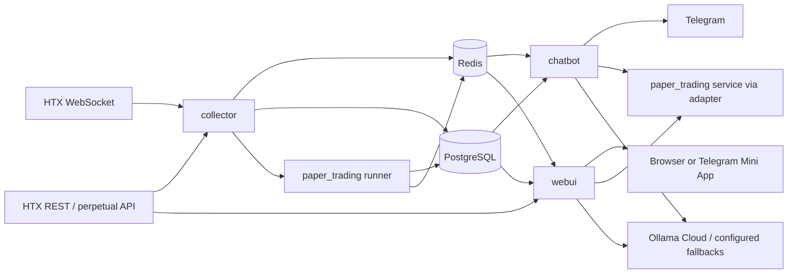

# WORED: полный контекст для нового агента

**Назначение.** Этот документ — исходная точка для инженера или агента, который впервые работает в `D:\WORED`. Он описывает устройство репозитория, активные пути выполнения, контуры, правила безопасной работы, проверку результатов и незавершённые области. Его нельзя использовать как доказательство того, что сервисы сейчас запущены или что какая-либо приёмка пройдена: такие факты нужно проверять в текущем ходе работы.

**Дата сверки исходников:** 16 сентября 2026. Рабочее дерево на момент сверки было dirty и содержало как tracked, так и untracked изменения. Не сбрасывайте дерево, не восстанавливайте его до коммита и не удаляйте чужие изменения. Перед началом любой работы создайте собственный read-only snapshot команд из раздела 3.

## 1. Что такое WORED

WORED — local-first система мониторинга крипторынка HTX, AI-аналитики, Telegram-управления, WebUI и paper trading. Корневой продукт не является реальной торговой системой: биржевые торговые ключи и реальные ордера не входят в штатный paper-trading контур.

Основной пользовательский сценарий Trading Day: **«Сегодня → Итоги → Обучение»**. У одного владельца есть два независимых симуляционных счёта:

| Счёт | Назначение | Требование изоляции |
|---|---|---|
| `manual` | Ручные preview/open/partial close/close | Свой баланс, позиции, лимиты, команды и отчёт |
| `auto` | Стратегия/план/runner | Свой баланс, позиции, лимиты, origin, отчёт и причины ожидания |

Forecast, торговый план, ордер, исполнение, риск, проводки, P&L и обучение — отдельные сущности. Прогноз или AI-текст не является сделкой. Отсутствие сделки допустимо только с конкретной актуальной причиной (`waiting_regime`, `waiting_trigger`, `risk_blocked`, `data_stale`, `cooldown`, `no_trade`, `plan_expired`, `quota`, `engine_error` и т. п.).

### Границы репозитория

| Область | Статус относительно корневого WORED | Как использовать |
|---|---|---|
| `chatbot/` | Active runtime path | Telegram UI, handlers, AI routing, часть Daily Session |
| `collector/` | Active runtime path | HTX ingestion, perpetual market, scheduler, runner registration |
| `webui/` | Active runtime path | FastAPI, HTML/JS Command Deck, HTTP adapters, health endpoints |
| `paper_trading/` | Domain package, монтируется в runtime-контейнеры | Общая модель paper trading, ledger, execution, risk, strategy, runner, service, adapter |
| `db/`, `migrations/` | Active data-definition sources | Bootstrap-таблицы и additive paper v2 schema |
| `config/` | Active configuration input | Provider registry и общая конфигурация, монтируется read-only |
| `tests/`, `scripts/`, `docker/` | QA and operations support | Tests, acceptance CLI, QA image and helpers |
| `docs/` | Project documentation | Prefer newer, scoped documents; see conflict rules below |
| `TASOCHKI/` | Specifications, handoff packages, historical delivery material | Normative only where explicitly stated in the matching package |
| `hypercube/` | Separate subproject | Has its own compose, docs, skills and architecture; do not call it root WORED runtime |
| `skills/`, `анализ/`, `scratch/`, backup folders | Support, historical or exploratory material | Do not treat as runtime-critical without import/container proof |

## 2. Sources of truth and how to resolve conflicts

Documentation accumulated over several iterations. Some older files describe Qwen/DashScope chains, historical runtime results, 5-service topology, or previous acceptance results. Do not silently blend them with current code.

Use this precedence for work on the root project:

1. A newer direct instruction from the owner.
2. Root `AGENTS.md`: safety rules, active paths, WebUI guardrails and change procedure.
3. Current code, Compose files, migrations and runtime logs/state inspected in the present task.
4. The scoped specification for the feature being changed. For paper trading, this is `TASOCHKI/HERMES-ACTIVE-PAPER-TRADING-V1/` plus `docs/HERMES-PAPER-TRADING-ACCEPTANCE-CLOSURE-20260916.md`.
5. Current focused runbooks, such as `docs/PAPER-TRADING-RUNBOOK.md`, `docs/ENV-REGISTRY.md`, `docs/UIUX-TESTING.md`, and `docs/hermes/playbooks/*`.
6. Historical reports, old handoffs, backup folders and prior test claims.

When two sources disagree, record the conflict, quote the paths, inspect the active import/call path, and run a fresh relevant check. Never make a configuration file or an older report proof of live routing, active model, loaded code, database state, browser acceptance or Telegram acceptance.

Known examples that require this discipline:

- `docs/02-architecture.md` contains legacy Qwen-oriented provider descriptions, while root `AGENTS.md` and `.env.example` identify Ollama Cloud as primary and Qwen/DashScope as inactive for current WORED.
- Root `AGENTS.md` describes the canonical five product roles. Actual `docker-compose.yml` also declares `chatbot_wored`, so the compose topology has six declared services.
- `docs/PAPER-TRADING-FINAL-REPORT.md` contains a summary that does not match the count in its own AC rows. Its AC-26 artifact has a nested `feed_freshness: FAIL` despite a top-level PASS. Treat it as evidence to audit, not a release certificate.
- `tests/paper_trading/test_integration.py` calls itself integration tests but states that it runs without a database. It proves arithmetic/logic only, not PostgreSQL transactions or races.
- `tests/paper_trading/fixtures/recorded_btcusdt_1m_candles.json` is labelled synthetic. It cannot satisfy a recorded perpetual replay requirement.

## 3. First 15 minutes: safe discovery

Run these commands from PowerShell in `D:\WORED`. They are read-only except that `docker compose config` performs local interpolation; it does not start or alter containers. Do not print `.env`, `.env.postgres`, DSNs, API keys, tokens, passwords or bearer headers.

```powershell
Set-Location -LiteralPath 'D:\WORED'
git status --short
git rev-parse HEAD
git diff --stat
docker compose config --quiet
docker compose ps
docker compose logs --tail 120 collector
docker compose logs --tail 120 chatbot
docker compose logs --tail 120 chatbot_wored
docker compose logs --tail 120 webui
```

If production containers are authorised for read-only diagnosis, continue with the commands already approved in root `AGENTS.md`:

```powershell
curl.exe -fsS http://127.0.0.1:8080/healthz
curl.exe -fsS http://127.0.0.1:8080/readyz
curl.exe -fsS http://127.0.0.1:8080/api/health
docker compose exec -T redis redis-cli GET market:perpetual:htx:BTC-USDT
docker compose exec -T redis redis-cli GET paper_trading:runner:heartbeat
```

Sanitize any values before saving them to evidence. The final two Redis keys may be absent; absence is an observation that requires diagnosis, not a reason to create data or restart anything.

Before a patch, report all five items required by `AGENTS.md`:

1. Goal of the change.
2. Active runtime path or explicit legacy area.
3. Exact files to change.
4. Regression risk.
5. Exact verification commands.

For source changes use **PLAN → DIFF → APPLY → TEST → REPORT**. Root guardrails require explicit owner confirmation for changes to `.env`, `.env.postgres`, `docker-compose.yml`, a live-service restart, `docker compose down`, file deletion, runtime logic under `chatbot/` or `collector/`, and legacy areas. Never run `docker compose down -v`, delete project directories/volumes, print secrets, or `git push` without an explicit request.

## 4. Runtime topology

`docker-compose.yml` declares these services. The table describes configuration, not current health.

| Service | Container | Image/runtime | Environment source | Host exposure | Main responsibility |
|---|---|---|---|---|---|
| `postgres` | `htx_trading_bot_postgres` | PostgreSQL 16 | `.env.postgres` | `127.0.0.1:5432` | Persistent project state |
| `redis` | `htx_trading_bot_redis` | Redis 7 | Compose defaults | `127.0.0.1:6379` | Hot cache, pub/sub, heartbeat/snapshots |
| `collector` | `htx_trading_bot_collector` | Python 3.9 | `.env` | none | HTX data, scheduled jobs, paper runner registration |
| `chatbot` | `htx_trading_bot_chatbot` | Python 3.9 + aiogram | `.env` | none | Main Telegram bot |
| `chatbot_wored` | `htx_trading_bot_chatbot_wored` | Python 3.9 + aiogram | `.env.wored` | none | Second Telegram bot using the same source image |
| `webui` | `htx_trading_bot_webui` | Python 3.11 + FastAPI | `.env` | `127.0.0.1:${WEBUI_PORT:-8080}` → `8000` | Browser dashboard and HTTP API |

All app containers mount source directories. `paper_trading/` is mounted read-only at `/opt/paper_trading`; the relevant `PYTHONPATH` entry is `/opt`, therefore the import is `paper_trading`, not a relative file copy. `config/` is read-only. The collector also reads `chatbot/` and `webui/` as read-only mounts, so a local diff can affect container imports without an image rebuild; inspect the running container and mounted path before claiming which version is loaded.

`postgres_data` is the only named volume declared in the root Compose file. Treat it as production data. The root bootstrap SQL is `db/init.sql`; additive paper v2 schema is `migrations/paper_v2_schema.sql`. Do not modify a migration known to be applied; add a new version and verify it in QA first.

### Service and data flow



The diagram represents intended paths. For any issue, confirm the actual function call and container import instead of relying only on this view.

## 5. Code map

### 5.1 Collector: data and scheduled execution

Entry point: `collector/main.py`.

Startup sequence:

1. Creates PostgreSQL pool and Redis client.
2. Ensures forecast tables and Daily Pipeline tables on a best-effort basis.
3. Starts spot WebSocket listener (`htx.websocket.ws_listen`) and perpetual publisher (`htx.perpetual_market.publish_perpetual_markets`).
4. Starts APScheduler tasks: AI journal, alert checks, forecast evaluation, simulation monitor, pipeline jobs, cleanup and market context publication.
5. Calls `paper_trading.adapter.register_runner(scheduler)`. Registration is configuration- and dependency-dependent; inspect its return/logs and heartbeat rather than assuming it runs.

Important directories:

| Path | Responsibility |
|---|---|
| `collector/htx/` | HTX WebSocket, REST and perpetual market ingestion |
| `collector/indicators/` | Indicator calculation and published market context |
| `collector/storage/` | Redis and PostgreSQL access |
| `collector/scheduler/` | Alerts, simulation monitoring and pipeline jobs |
| `collector/journal/` | Periodic AI journal writes |
| `collector/predictions/` | Forecast evaluation |

Live perpetual paper input is expected in Redis key `market:perpetual:htx:BTC-USDT`; validation must distinguish bid/ask execution prices from mark price used for risk and funding data. Never replace missing live data with demo values and then present it as HTX paper evidence.

### 5.2 Chatbot: Telegram control plane

Entry point: `chatbot/main.py`. It creates an aiogram `Bot` and `Dispatcher`, includes routers in a deliberate order, then starts polling with `drop_pending_updates=True`. `chat_router` is intentionally last because it catches generic text.

Registered handler families include:

| Path | Main responsibility |
|---|---|
| `handlers/start.py`, `menu.py`, `callbacks.py` | Start, menu and navigation |
| `handlers/market.py`, `alerts.py`, `portfolio.py`, `news.py` | Market, alerts, portfolio and news |
| `handlers/analytics.py`, `chat.py` | AI analysis and free-text requests |
| `handlers/predictions.py`, `plans.py` | Forecast and plan views |
| `handlers/pipeline.py` | Trading Day commands, callbacks, status, plan, pause/resume, result |
| `handlers/trader.py` | Trader menu and UI navigation |
| `handlers/admin.py` | Admin commands and provider checks |
| `handlers/hermes_admin.py` | Optional Hermes gateway, enabled only by `HERMES_CHATBOT_GATEWAY_ENABLED` |
| `services/` | Session, plan, execution, storage, market and status logic |
| `ai/` | Contracts, provider gateway/adapters, router, resilience and model work |

At startup the bot starts `alert_listener`, which subscribes to `market_alerts`, and `_sim_ai_monitor`, which checks legacy AI-managed simulation positions. Do not equate this monitor with the paper v2 runner: trace its storage and accounting path before changing either. The second Compose bot uses the same code but a different env file; determine the token and intended bot identity safely through configuration presence and logs, never by exposing values.

Telegram messages and callbacks that mutate orders, sessions or positions must be idempotent, ownership-checked, and represented as commands whose status can be shown as pending/result. Browser emulation cannot prove real Telegram Mini App behavior.

### 5.3 WebUI: FastAPI control and operations surface

Entry point: `webui/app.py`, launched as `uvicorn app:app --host 0.0.0.0 --port 8000`. It owns FastAPI lifespan initialization, session authentication, traditional HTML routes and a large group of operational APIs. `webui/paper_api.py` is mounted as the `/api` paper-trading router.

Important routes:

| Area | Examples | Notes |
|---|---|---|
| Health | `/healthz`, `/readyz`, `/api/health` | Each has a different contract; use all relevant endpoints for smoke evidence |
| Core UI | `/`, `/dashboard`, `/alerts`, `/journal`, `/predictions` | These routes must be retained |
| Trading UI | `/trading-day`, `/daily-session`, `/command-deck`, `/futures-lab`, `/strategy` | Inspect templates and API owner before altering a flow |
| Paper v2 API | `/api/trading-day/current`, `/settings`, `/start`, `/{day_id}/automation`, `/finish`, `/next`, paper order/position/command APIs | Implemented in `webui/paper_api.py` through the domain adapter |
| Legacy Daily Session API | `/api/daily-session/*` and `/api/positions/*` | Different surface; do not silently assume shared ledger with paper v2 |
| Market/forecast APIs | `/api/tickers`, `/api/candles`, `/api/alerts`, `/api/journal`, `/api/predictions/*` | Read current contract before frontend changes |

Relevant UI assets:

| Path | Responsibility |
|---|---|
| `webui/templates/base.html` | Shell, navigation and shared layout |
| `webui/templates/trading_day.html` and related templates | Daily session and operational views |
| `webui/static/styles.css` | Existing Command Deck system and tokens |
| `webui/static/app.js` | Existing application behavior; must be retained |
| `webui/static/ui/core.js`, `async-patterns.js` | Shared client behavior and request patterns |
| `webui/static/ui/forecast*.js` | Forecast UI/chart code |
| `webui/static/ui/ticket.js`, `session.js`, `trading-day.js` | Order ticket, session and Trading Day behavior |

WebUI design guardrails are mandatory: evolve the current Command Deck incrementally; do not replace `styles.css` wholesale, remove `app.js`, delete existing pages, routes or the price/volume/RSI/MACD chart containers. Preserve the dark command surface, orange accent, green OK, red risk and blue price line. Operational clarity is more important than marketing decoration.

### 5.4 Paper trading v2: shared domain layer

The intended common layer is `paper_trading/`:

| Module | Responsibility |
|---|---|
| `contracts.py` | Domain enums and data contracts: owner, account, day, command, order, fill, position, posting and statuses |
| `ledger.py` | Append-only financial posting, gross/net P&L and partial-exit fee allocation |
| `repository.py` | PostgreSQL persistence, row conversion, idempotency and leases |
| `market.py` | Perpetual snapshot validation, bid/ask execution, slippage and visible liquidity |
| `risk.py` | Risk gates, size, leverage, spread, SL/liquidation and loss controls |
| `execution.py` | Market execution, close, SL/TP, funding and unrealized P&L |
| `strategy.py` | `baseline_v1`: EMA/ATR, 1h/15m/1m gates, TTL, cooldown and deduplication |
| `runner.py` | Recovery, fencing, cycles, signal → order → fill → posting, and protection management |
| `planner.py` | AI plan validation, quotas and valid `no_trade` outcome |
| `learning.py` | Chronological evaluation, holdout/purge gap and next-day candidate activation |
| `presenters.py` | Status, reason, card and report DTO formatting |
| `service.py` | Commands to start day, submit orders, close, pause/resume, finish and prepare next day |
| `adapter.py` | Bridges collector, WebUI and chatbot to the domain service and runner registration |

Rules that protect accounting:

- Manual and auto accounts are independent. A manual operation cannot alter the auto account, and an auto-origin position stays auto-origin.
- A command must have an idempotency key; retry must not create a second financial effect.
- Long entries execute at ask and exits at bid; shorts enter at bid and exit at ask. Mark price serves risk/funding, not execution.
- Fees, funding, slippage, gross P&L, net P&L and ledger postings must agree. A partial close allocates the original entry fee instead of charging it twice.
- Protection must remain active when new entries are blocked, planner/AI is unavailable, or a session is paused.
- Recovery must fail closed for new entries when it cannot establish safe ownership; fencing prevents a stale runner from committing.
- A day is financially closed only after settlement and reconciliation. AI review may be deferred and must not block safe financial closeout.

The paper v2 DDL defines 18 `paper_v2_*` tables, including owners, accounts, days, commands, signals, orders, fills, positions, postings, decisions, heartbeats, leases, reports, strategy versions, evaluations, cutovers, events and schema versions. Actual database contents must always be queried in the current environment; table presence does not demonstrate a completed trade.

### 5.5 AI/provider routing

The current project-level policy in root `AGENTS.md` is:

| Tier | Provider/model intent |
|---|---|
| Primary | Ollama Cloud OpenAI-compatible endpoint |
| Premium | `glm-5.2` |
| Analyst | `deepseek-v4-pro` |
| Worker | `deepseek-v4-flash` |
| Reviewer | `minimax-m3` |
| Oracle/fallback | `kimi-k2.6`, `kimi-k2:1t` |
| Utility | TokenRouter `moonshotai/kimi-k3-free` |
| Fallback | NVIDIA NIM and OpenRouter only when primary is unavailable |

`config/provider_registry.json`, `chatbot/ai/provider_gateway.py`, `chatbot/ai/provider_adapters.py` and `chatbot/ai/router.py` implement parts of this policy. They must be read together with the environment that the target service actually receives. A configured key, model name or `200` from a list endpoint does not prove an inference route works. Never log provider credentials. When quota-limited, stop live LLM calls and validate deterministic paths, mocks and runtime state separately.

## 6. Database, Redis and persistent contracts

### PostgreSQL

`db/init.sql` bootstraps core tables for alerts, AI journal, simulations, forecasts and related project state. Other services ensure some schemas on startup, while `migrations/paper_v2_schema.sql` is the paper v2 additive schema. This split means that schema discovery must identify both bootstrap SQL and service-created tables.

Use `asyncpg` access helpers in the appropriate service rather than embedding SQL in handlers. When changing a cross-service record:

1. Identify the owner and account attribution.
2. Confirm the transaction boundary and idempotency behavior.
3. Update/reconcile the append-only ledger where money-like state changes.
4. Preserve historical versions; do not rewrite forecasts, fills, or postings to make a report look better.
5. Add a migration rather than modifying applied DDL.

### Redis

Redis stores fast-changing data and pub/sub, including `ticker:*`, `market_alerts`, perpetual snapshots and paper-runner heartbeat. It is not the financial system of record. A missing cache key, an old timestamp, or Redis restart must produce an explicit stale/unavailable state, never a fabricated market price.

### Time, market data and execution

Use timezone-aware UTC values at integration boundaries. Convert to local display only in presenters/UI. Trading replay needs source time plus deterministic sequence ordering. At equal timestamps, order liquidation/SL/TP, funding, closeout and entry deterministically. A bar-only fixture that crosses both SL and TP without intrabar path is ambiguous; it cannot choose the profitable outcome afterward.

## 7. Configuration and secrets

Templates: `.env.example`, `.env.postgres.example`, `.env.wored.example`. The actual `.env`, `.env.postgres` and `.env.wored` are secrets and must never be printed, copied into reports, committed or passed to model output.

Use `docs/ENV-REGISTRY.md` as the detailed key registry, but trace the current consumer because some variables changed names over time. Core categories:

| Category | Examples | Handling |
|---|---|---|
| Infrastructure | `DATABASE_URL`, `REDIS_URL`, `POSTGRES_*` | DSNs/passwords are secret |
| Telegram | `TELEGRAM_TOKEN`, `TELEGRAM_BOT_TOKEN`, `TELEGRAM_WORED_TOKEN`, admin IDs | Tokens are secret; admin ID is sensitive operational data |
| WebUI auth | `WEBUI_AUTH_ENABLED`, `WEBUI_ADMIN_*`, `WEBUI_SESSION_SECRET`, `WEBUI_INTERNAL_TOKEN` | Never disable or weaken auth casually; session/internal values are secret |
| Market/paper | `HTX_LINEAR_SWAP_BASE_URL`, `HTX_PERPETUAL_POLL_SECONDS`, `PAPER_CONTRACTS`, `PAPER_MARKET_*`, `PAPER_ENGINE_*` | Changes can change runtime behavior; do not modify production env without explicit approval |
| AI providers | `OLLAMA_CLOUD_*`, `TOKENROUTER_API_KEY`, `NVIDIA_*`, `OPENROUTER_API_KEY` | API keys are secret; model routing needs evidence |
| Feature gates | `PAPER_ENGINE_ENABLED`, `HERMES_CHATBOT_GATEWAY_ENABLED`, paid-provider/routing settings | Treat as cutover controls, not testing shortcuts |

Presence-only inspection must mask values. A safe pattern is to print only the key names or transform every `=` value to `=***`. Never use `cat .env`, shell history, debug exceptions or unredacted Docker inspect output as evidence.

## 8. Setup and runtime operations

### Local bootstrap

Prerequisites: Docker Desktop/Compose, Python matching the target check, available host ports 5432/6379/8080 and configured secrets. Start from templates; do not copy another machine's secret files.

```powershell
Set-Location -LiteralPath 'D:\WORED'
Copy-Item .env.example .env
Copy-Item .env.postgres.example .env.postgres
# Fill only the local secret files outside of logs or version control.
docker compose config --quiet
docker compose up -d --build
docker compose ps
curl.exe -fsS http://127.0.0.1:8080/healthz
curl.exe -fsS http://127.0.0.1:8080/readyz
curl.exe -fsS http://127.0.0.1:8080/api/health
```

The last three commands are smoke checks, not full browser, Telegram or trading acceptance. Root `AGENTS.md` requires explicit approval before applying a real `.env` change, Compose modification, restart or production migration. A new agent should normally prepare the diff, QA and rollback first, then ask for the concrete action.

### Diagnostic procedure

Use `docs/hermes/playbooks/diagnose-runtime.md` for broad runtime diagnosis and these focused sources where relevant:

| Problem | First sources |
|---|---|
| WebUI request, health or dashboard | `webui/app.py`, `docs/hermes/playbooks/fix-webui.md`, `docs/UIUX-TESTING.md` |
| Telegram command, callback or gateway | `chatbot/main.py`, relevant `chatbot/handlers/`, `docs/hermes/playbooks/fix-chatbot.md` |
| Feed, stale snapshot or scheduler | `collector/main.py`, `collector/htx/`, `docs/hermes/playbooks/fix-collector.md` |
| Provider route/model selection | `docs/hermes/model-routing.md`, `docs/hermes/playbooks/model-routing.md`, active adapter/gateway code |
| Paper runner/no positions | `paper_trading/adapter.py`, `runner.py`, `presenters.py`, `docs/PAPER-TRADING-RUNBOOK.md` |
| Database/migration | `docs/hermes/playbooks/db-maintenance.md`, migrations and QA rehearsal procedures |

Avoid interpreting “zero positions” from a page alone. Check in this order: current day state, runner heartbeat/recovery, perpetual snapshot age, strategy reason and numeric gate, plan state/expiry, risk result, pending commands/orders, fills/postings and actual logs. A strict strategy can legitimately wait; an unavailable runner or failed recovery cannot be relabeled as a strategy wait.

### Backup, rollback and destructive boundaries

The runbook has backup/restore suggestions, but new work must rehearse restore only in a disposable QA environment before using it for production. Rollback may disable new entries, but it must first establish which code protects any open position. Never delete `paper_v2_*` data as a rollback shortcut. Real production backup, schema change, service restart and migration require explicit approval tied to that exact action.

## 9. Quality assurance and evidence levels

Use the narrowest test that proves the change, then broaden only where the changed path needs it. Passing source syntax, Python unit tests or documentation checks never proves browser, Telegram, live feed or natural trading behavior.

### Isolated QA environment

`docker-compose.qa.yml` is the required starting point for paper-trading DB tests. It creates a `wored-qa` project with `postgres-qa`, a temporary `tmpfs` data directory and an internal network; test code gets `WORED_TEST_DATABASE_URL`. It must not attach production volumes, use production env files, send Telegram messages or place exchange orders.

```powershell
Set-Location -LiteralPath 'D:\WORED'
docker compose -p wored-qa -f docker-compose.qa.yml config --quiet
docker compose -p wored-qa -f docker-compose.qa.yml run --build --rm checks python -m pytest tests/paper_trading -q -p no:cacheprovider
docker compose -p wored-qa -f docker-compose.qa.yml run --rm checks python -m ruff check paper_trading scripts/run_paper_acceptance.py tests/paper_trading
docker compose -p wored-qa -f docker-compose.qa.yml run --rm checks python -m mypy paper_trading --no-incremental
```

`docker/qa.Dockerfile` copies the project into the image. Rebuild the QA image after source changes. If a report must survive `--rm`, write/export it deliberately to the host; a path left only inside the removed container is not evidence.

### Acceptance levels

| Level | What it can prove | What it cannot prove |
|---|---|---|
| Unit/offline | Pure calculations, validation, formatters and deterministic domain rules | Database transactions, concurrent execution, containers, UI or live market |
| PostgreSQL integration | Transactions, uniqueness, idempotency, recovery and race behavior against disposable DB | Live production runtime, browser or real Telegram |
| Recorded replay | Deterministic strategy/execution lifecycle against provenance-tracked market events | Current feed health or a natural live trade |
| Browser fixture | Page behavior at specified viewports against a controlled server | Real Telegram WebView or production state |
| Real browser | Actual browser flow, screenshots and API/UI integration | Telegram client behavior unless run inside it |
| Telegram mock | Handler/callback contract and idempotency | Telegram Mini App safe areas and real client UX |
| Real Telegram client | Bot/Mini App behavior on supported device/client | Full natural trading lifecycle unless observed |
| Live observation | Current heartbeat/feed/state over an observation window | A natural fill/close unless it happened and was reconciled |

### Paper trading acceptance

Normative cases AC-01…AC-28 are in `TASOCHKI/HERMES-ACTIVE-PAPER-TRADING-V1/ACCEPTANCE.md`. Every case needs a case record with status `PASS`, `FAIL` or `BLOCKED`, environment, UTC interval, Git revision/dirty hashes, exact command, expected/actual values, assertions, artifact paths/hashes and residual limitations. For trade cases include anonymised owner/account/day/strategy/plan/snapshot/signal/order/fill/position IDs plus fees, funding, gross/net P&L and reconciliation.

Required outstanding/evidence-sensitive areas include:

- AC-05/06: concurrent idempotency, crash/recovery and fencing against disposable PostgreSQL.
- AC-14: real recorded perpetual replay with at least one natural long and one natural short lifecycle; synthetic bars do not qualify.
- AC-16: stale plan response races with pause, finish and new plan versions.
- AC-19/20: actual desktop/mobile browser and real Telegram/Mini App checks.
- AC-21/22: dual-account closeout, retries, missing price, settlement and ledger/report reconciliation.
- AC-24: migration, backup/restore and rollback rehearsal in disposable QA.
- AC-26: 60-minute live observation with continuous raw evidence, health endpoints, fresh feed and a semantic state transition.
- AC-27: natural, unforced auto signal → fill → exit → reconciled P&L visible in Telegram and WebUI.

For AC-27, no natural signal during an agreed window is `BLOCKED awaiting_natural_signal` with the last numeric reason and timestamp. It is not a reason to change strategy parameters, fabricate a feed, inject an intent, or call the system accepted. A failed required assertion has precedence over top-level success wording.

### UI/Telegram acceptance

Use `docs/UIUX-TESTING.md` and `docs/UIUX-ACCEPTANCE.md`. Current project expectations include at least desktop 1440×900 and mobile 390×844 for the Trading Day acceptance flow; project UI guardrails additionally use 320×800, 390×844, 844×390 and 1280×800. Validate overflow, error/loading/stale/offline states, chart preservation, keyboard/accessibility and double-submit handling. Test a real Telegram client separately on Android/iOS when requested; an ordinary browser is not a substitute.

## 10. Current paper-trading and UI delivery state

The codebase has substantial paper-trading implementation and multiple reports. It does **not** follow that full acceptance is complete. New agents must use `docs/HERMES-PAPER-TRADING-ACCEPTANCE-CLOSURE-20260916.md` to reconcile reports and evidence before changing the acceptance status.

This closure specification directs the next agent to:

1. Recompute all 28 AC statuses from primary artifacts and reject inconsistent aggregation.
2. Recheck F01…F08 audit-fix claims with regression evidence and matching revisions.
3. Build/run disposable PostgreSQL suites for idempotency, crash recovery, fencing, plan races and dual-account closeout.
4. Add or obtain provenance-tracked recorded perpetual data for replay.
5. Rehearse migration, backup, restore and rollback in QA.
6. Carry out browser/Telegram acceptance only in authorised test context.
7. Repeat AC-26 only with valid raw assertions; observe AC-27 naturally without forcing a trade.

Do not change the acceptance matrix merely to turn incomplete work into PASS. The difference between specification, implemented code, QA result, runtime observation and release status must remain visible in all reports.

## 11. Design, security and product rules

### Trading honesty

- Paper simulation must be labelled paper/simulated. It is not investment advice or an exchange execution system.
- Use bid/ask for simulated fills, mark for risk, and actual received timestamps for staleness.
- Keep forecast, recommendation, planned intent, order, fill, position and P&L visually and in storage distinct.
- A no-trade result is valid; do not create artificial entries to produce a non-zero counter.
- AI review must never rewrite financial facts. Existing postings and forecasts remain immutable evidence.
- Manual and automatic accounts must remain comparable and independently attributable.

### Security

- Store secrets only in local env files; never in code, docs, outputs, screenshots, artifacts, logs, prompts or git commits.
- Restrict Telegram admin behavior through configured IDs and retain server-side auth for WebUI/Mini App. `initDataUnsafe` is not trusted identity.
- Keep WebUI CSRF/origin/session controls intact. Do not weaken auth for test convenience.
- Default-deny dangerous actions, sanitize logs and avoid exposing provider errors that contain credentials.
- Review prompt injection and tool-misuse implications when adding AI functionality. Provider success/failure and token accounting are operational data, not a reason to reveal keys.

### UI design

- Keep the dense, readable Command Deck. Use existing semantic tokens and current components.
- Preserve all existing pages, `app.js`, routes `/`, `/alerts`, `/predictions`, `/journal`, and chart containers.
- Do not treat SVG mockups, static HTML or a green test as browser acceptance.
- Show clear status for loading, empty, stale, offline, unauthorized, queued, running, partial, failed, expired, `no_trade` and invalid preview states.
- On mobile use one-column, touch-safe actions and Telegram safe-area-aware behavior; do not simply compress desktop tables.

## 12. Recommended work order for a new agent

1. Read root `AGENTS.md`, this handoff, then the feature-specific specification.
2. Capture Git/Compose/runtime snapshot read-only and identify unrelated dirty changes.
3. Trace one complete active path before editing: user action → handler/API → adapter/service → repository/Redis → response/presenter.
4. State PLAN with active path, files, risks and checks; wait for any explicit approval required by root guardrails.
5. Implement the smallest coherent patch. Keep legacy code separate unless the task explicitly makes it active.
6. Run targeted checks in isolated QA. For code changes, include syntax/lint/type checks appropriate to touched Python/JS and relevant tests.
7. Test actual browser/Telegram/runtime only when their environment and mutating scope are authorised.
8. Update the documentation closest to behavior, configuration, runbook and acceptance evidence. State commands actually run and result; never copy an expected result as if it occurred.
9. Report remaining uncertainty separately from failures and completed evidence.

## 13. Documentation index

| Need | First document |
|---|---|
| Root safety, active paths and change approvals | `AGENTS.md` |
| Product overview / architecture / setup | `README.md`, `docs/01-overview.md`, `docs/02-architecture.md`, `docs/03-setup.md` |
| Configuration and secrets | `docs/04-configuration.md`, `docs/ENV-REGISTRY.md`, `.env.example` |
| Operations | `docs/05-operations.md`, `docs/OPERATIONS-RUNBOOK.md`, `docs/hermes/playbooks/diagnose-runtime.md` |
| Security | `docs/07-security.md`, `docs/hermes/playbooks/security-audit.md` |
| UI behavior and QA | `docs/UIUX-TESTING.md`, `docs/UIUX-ACCEPTANCE.md`, `docs/CODEX-TRADING-UI-AGENT.md` |
| Trading Day concepts | `docs/TRADING-DAY-PIPELINE-RFC.md`, `docs/TRADING-SIMULATOR-AGENT-CONTRACT.md`, `docs/SESSION-PLAN-V2.md` |
| Paper implementation/runbook | `docs/PAPER-TRADING-IMPLEMENTATION.md`, `docs/PAPER-TRADING-RUNBOOK.md` |
| Paper normative requirements | `TASOCHKI/HERMES-ACTIVE-PAPER-TRADING-V1/README.md`, `ACCEPTANCE.md`, `TASKS.json`, `EVIDENCE.md` |
| Acceptance closure and evidence consistency | `docs/HERMES-PAPER-TRADING-ACCEPTANCE-CLOSURE-20260916.md` |
| Provider/model routing | `docs/PROVIDER-REGISTRY.md`, `docs/hermes/model-routing.md`, `docs/hermes/playbooks/model-routing.md` |
| Existing limitations and historical evidence | `docs/KNOWN_LIMITS.md`, `docs/STABILIZATION-STATUS.json`, historical reports marked with dates |
| Separate gateway subproject | `hypercube/README.md` and `hypercube/docs/INDEX.md`; use only when the task explicitly targets hypercube |

## 14. Definition of a good handoff and completion

A new agent should be able to answer these questions with current evidence before declaring work complete:

- Which source file and container currently execute the changed behavior?
- Which owner, account and ledger records are affected by a paper-trading action?
- Is the result unit-only, QA database, replay, browser, real Telegram or live evidence?
- Which exact command produced the evidence, at what revision, in what environment?
- What is still unknown, blocked or unsafe to run without approval?
- How can a teammate reproduce the check and roll back safely if it fails?

If any answer is missing, document the gap and continue independent QA work. Do not replace evidence with plausible explanation, code volume, number of tables, a single health response, a fixture result or an AI model configuration.
