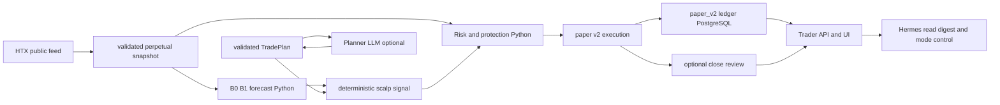

# План реализации WORED Trader Agent V0 1

## 1. Цель и границы решения

Этот план уточняет реализацию пакета `TASOCHKI/WORED-TRADER-AGENT-V0.1`. Цель — получить работающий, наблюдаемый и экономный paper-trader для одного инструмента `BTC-USDT` в isolated one-way режиме: настоящий публичный perpetual feed, один общий финансовый контур, безопасный автоматический счёт, ручной счёт, детерминированная защита, прогноз, часовой план, UI `/trader` и отчётность.

План не разрешает реальные ордера, изменение production env/Compose, миграции или рестарты. Это отдельные действия после готового diff, изолированного QA и явного подтверждения владельца. Все примеры параметров являются paper-параметрами, а не советом по торговле или утверждением о текущем состоянии HTX.

Под «минимальными затратами на токены» понимается исключение LLM из горячего торгового контура, отсутствие live LLM-вызовов в разработке и короткие, кэшируемые, событийные вызовы после внедрения. Необходимые проверки риска, финансовых проводок, изоляции счетов и миграций не сокращаются: это небольшие целевые тесты, а не лишняя регрессия.

## 2. Вывод после анализа ТЗ

ТЗ задаёт правильную архитектуру, но его текущий объём не соответствует «узкому v0.1». Блоки A–F требуют одновременно новый WebSocket ingestion, historical store, прогнозный ML-контур, V5 risk/execution, восемь LLM-ролей, профиль Hermes с MCP, новую UI-страницу и 14-дневное наблюдение. Это следует разделить на функциональный релиз, qualification run и будущие эксперименты.

Рекомендуемая граница **функционального v0.1**:

- один инструмент и один режим: `BTC-USDT`, isolated, one-way, market fills;
- два и только два рабочих счёта владельца: `manual` и `auto`;
- `auto` работает с профилем P0 или P1, P2/P3 выключены по умолчанию;
- вход, исполнение, защита, размер, ликвидация, funding, timeout, closeout и reconciliation выполняются детерминированно;
- прогноз B0/B1 и deterministic signal доступны до активации; входы допускаются только после walk-forward gate;
- LLM создаёт или уточняет план в плановом, а не тиковом контуре; любой отказ LLM безопасно приводит к `reduce_only` или сохранению ограниченного прошлого плана;
- `/trader` показывает фактические данные и принимает только смену режима через общий command path;
- Hermes получает read-only digest и право `set_mode`/`submit_trade_plan` с idempotency key; не получает инструментов ордеров.

**Полная квалификация v0.1** наступает позже: после прохождения целевых AC, 14 дней непрерывной paper-работы и отчёта KPI. Отсутствие сигнала за окно наблюдения — `BLOCKED awaiting_natural_signal`, а не дефект, который исправляют ослаблением риска.

## 3. Сильные стороны ТЗ

| Сильная сторона | Почему это ценно | Сохранить в реализации |
|---|---|---|
| Один perpetual-инструмент и paper-only scope | Снижает число контрактов, режимов и источников ошибок | Не добавлять другие пары, cross margin или real orders |
| Явное разделение data, protection, signal, forecast, decision, control и UI planes | Не позволяет медленной модели управлять защитой позиции | Python protection и risk остаются единственным исполнителем закрытий |
| Требование V5 risk tier и mark-price liquidation | Исправляет текущую упрощённую формулу с `MMR=0.005` | Получать tier из validated snapshot; без tier блокировать новый вход |
| Реалистичная модель bid/ask, fee, funding, liquidity и liquidation | Делает P&L и риск проверяемыми | Использовать `Decimal`, append-only postings и reconciliation |
| Два manual/auto счёта | Делает сравнение честным | Отдельные balances, limits, positions, origin и reports |
| JSON schemas и provider gateway | Предсказуемая интеграция с LLM и единый учёт | Никаких отдельных HTTP-клиентов к провайдерам |
| Явные fallback и `reduce_only` | Деградация не становится скрытой торговлей | Fail closed для новых входов, protection продолжает работу |
| Доказательные критерии по данным, риску, UI и бюджету | Не позволяет назвать макет или импорт готовым продуктом | Хранить evidence с Git SHA, средой и первичными артефактами |
| UI как операционный терминал | Позволяет видеть причину ожидания, риск и состояние | Инкрементально расширять Command Deck |

## 4. Слабые места и обязательные правки ТЗ

| Приоритет | Проблема | Последствие | Правка в этом плане |
|---|---|---|---|
| P0 | ТЗ требует одновременно два счёта `manual/auto` и четыре `auto_p0…auto_p3` | Непонятный владелец, четыре параллельных риска и некорректное сравнение | Один реальный `auto` с активным P0/P1. P1–P3 сравниваются offline/replay как shadow results, без счетов и проводок production |
| P0 | ТЗ называет LLM «вне горячего контура», но запускает Entry-Gate на каждый сигнал | До 150 запросов/сутки, latency и расход; возможный отказ на входе | В v0.1 Entry-Gate — deterministic policy из валидированного TradePlan. LLM Gate оставить выключенным experiment flag для v0.2 |
| P0 | В `paper_trading/risk.py` сейчас упрощённый `MMR=0.005` | На 100–200x ликвидация рассчитывается неверно | Сначала Block B: tier-aware V5 model, unit tests и QA transaction test; до этого auto entries disabled |
| P0 | Фиксированное `mmr=0.0028` в ТЗ может устареть | Paper риск перестаёт соответствовать бирже | `0.0028` использовать только в fixture. Runtime получает свежий tier с временем/источником; missing/stale/malformed tier → `risk_tier_missing` и no entry |
| P1 | A–F смешивают базовую торговую функцию, ML research, Hermes profile и UI | Большой diff сложно проверить и откатить | Шесть малых поставок с одним критерием выхода каждая; profile/soak не блокируют детерминированный QA |
| P1 | Блок C требует B0, B1, M1, M2 и ансамбль до первой активации | Неподтверждённый ML и новые зависимости задерживают безопасный runner | B0/B1 как runtime baseline; M1/M2/ensemble сначала offline experiment. Входы только после B1 против B0 gate |
| P1 | Источник truth раздвоен между legacy Daily Session, `paper_v2_*` и новыми `trader_v1_*` | Дублирование orders/fills/positions/ledger и разные P&L | `paper_v2_*` остаётся единственным источником account/day/order/fill/position/posting. `trader_v1_*` хранит только candles, forecasts, plans, agent runs и reviews с FK |
| P1 | Стек ролей и fallback-cascade слишком дорогой для старта | Расход растёт, данные дублируются, диагностика сложнее | Один Planner; Critic только при новой версии плана; Coach только по закрытию; Daily/Weekly сначала детерминированны. Не более одного fallback на исходный request |
| P1 | 14 дней observation записаны как критерий «завершения реализации» | Нельзя завершить код до ожидания времени | Разделить implementation complete, QA complete, runtime qualification и business KPI |
| P2 | Mockup может восприниматься как UI acceptance | Непроверенные действия и responsive bugs | API contract и fixture browser сначала; реальный browser/Telegram только один раз после стабилизации flow |
| P2 | Модельная конфигурация и тарифы изменчивы | Неверный budget/route | Перед включением live LLM один provider inventory audit, затем фиксировать snapshot registry; не делать probes при каждом изменении кода |

## 5. Архитектурное решение для экономного v0.1

### 5.1 Один источник истины

`paper_trading/` остаётся доменным ядром. WebUI, Telegram и Hermes не считают P&L, risk, liquidation или size; они отправляют/читают команды. Redis хранит snapshot, stream/event, cache и heartbeat, но не финансовую истину.

### 5.2 Упрощённый набор компонентов

| Компонент | Решение v0.1 | Не включать до доказанного результата |
|---|---|---|
| Perpetual feed | Новый адаптер WS только для `bbo`, `depth.size_20`, mark, closed 1m/60m candles; REST history/recovery | Trade-detail/OI/liquidation features, если B1 не требует их |
| Risk tier | REST V5 lookup с schema validation и cache TTL 1 час | Константа MMR в runtime |
| Risk/execution | P0/P1, one open position/account, market fill, SL/TP/liq/funding/timeout; `adjust_margin` и `reverse` поддержаны как commands | Автоматическая доливка, P2/P3 auto activation, post-only live behavior |
| Forecast | B0 naive + B1 deterministic quantile/statistical baseline; forecast/eval persisted | M1/M2 ensemble в trading path до walk-forward superiority |
| Signal | `scalp_forecast_v1` полностью Python: plan, forecast, snapshot age/spread, cooldown, position and risk gates | LLM decision on each signal |
| LLM | Planner at bounded cadence, Critic at plan revision, Coach after close, optional weekly report | Scout every hour, Gate per signal, routine Hermes/subagent chatter |
| Hermes/MCP | Seven defined interfaces, but deployment initially uses read tools plus `set_mode` and `submit_trade_plan` only | Order/close/limit-change tools and automated incident delegation |
| UI | `/trader`, read state/candles/forecast/positions/activity and `POST /mode`; SSE from existing event stream | Separate frontend framework, rewrite of existing pages, extra chart engine |

### 5.3 Token policy

The existing environment defaults of `PAPER_AI_MAX_REQUESTS_PER_DAY=48` and `PAPER_AI_MAX_TOKENS_PER_DAY=200000` are safer than the v0.1 draft's 400-request budget. Preserve or lower them for the first runtime qualification. Configure through a versioned `config/trader_roles.json`; do not change production `.env` during implementation.

| Role | Trigger in lean v0.1 | Maximum | Prompt/output budget | Fallback |
|---|---|---:|---:|---|
| Planner | Plan expired or material regime fingerprint changed; at most once per 2 hours | 12/day | ≤1,500 input feature tokens, ≤300 output tokens | Previous plan once for 30 min with `max_entries/2`, then `reduce_only` |
| Forecast-Critic | Only after a newly accepted Planner plan | 12/day | ≤800 / ≤160 | `confidence_multiplier=0.85`; never increase confidence |
| Journal-Coach | Closed auto position, after reconciliation | 4/day | ≤1,000 / ≤220 | Record deterministic summary; no retry |
| Daily/Weekly review | Deterministic Markdown/JSON by default; owner-triggered LLM narrative or weekly only | 1 weekly | ≤5,000 / ≤500 | No LLM narrative |
| Hermes | Owner command or severity alert only | 2/day automated | Digest with IDs/metrics, no raw log dump | Alert remains in queue; runtime continues |
| Entry Gate / Scout | Disabled in v0.1 runtime | 0 | 0 | Deterministic policy |

At the model prices stated in the supplied TЗ, this removes the 150 daily Gate calls and the routine Scout calls. The expected spend is below the old Economy estimate and should target **≤ $5/month** before optional owner-triggered reviews. This is a planning estimate, not a current provider quote; reprice it once from an authorised provider inventory snapshot before enabling live LLM.

Every LLM call uses a normalized feature record, `features_hash` and `plan_version`. Reuse a result when the hash has not changed within the role TTL. A malformed response is recorded once, then uses deterministic fallback. Do not make a “corrective retry” plus a multi-provider cascade for the same signal; one schema-repair retry is allowed only for Planner and must count against budget.

## 6. Detailed implementation plan

### Phase 0 — freeze contracts and remove ambiguity

**Goal:** establish a minimal, unambiguous target before changing runtime code.

**Files:** create `docs/WORED-TRADER-V0.1-DECISIONS.md`; update only the v0.1 specification companion/plan documents. No runtime code.

**Decisions to record with defaults:**

1. Active live profile is P0; P1 only after QA and explicit activation; P2/P3 disabled. `PAPER_ALLOW_P3=false` remains non-negotiable.
2. Starting balances use the existing two-account setup; no four auto accounts. If the owner has not provided a number, preserve current stored opening deposits rather than inventing `$100`.
3. Runtime MMR is the validated V5 tier, never a hard-coded number; no tier means no new auto entry.
4. `adjust_margin` and `reverse` are command-capable and audited but automatic top-up/reversal is off initially.
5. B1 must pass walk-forward against B0 before any auto entry. Before that auto is `no_trade:model_below_baseline`.
6. Telegram delivery uses one daily summary plus severity alerts; no message per trade by default.
7. The current Hermes profile stays unchanged. A separate profile is prepared only after in-repo core behavior is ready.

**Single exit check:** review the decision record against `AGENTS.md`, the v0.1 TЗ and existing `paper_v2_*` schema. No Docker, browser, provider or live-market call is needed in this phase.

### Phase 1 — data contract and historical store

**Goal:** give all later logic one validated perpetual market contract.

**Implementation:**

- Add `collector/htx/linear_swap_ws.py` with only the required public subscriptions, GZIP decoding, ping/pong, reconnect/backoff and explicit `received_at` timestamps.
- Add `collector/htx/history_loader.py` for idempotent REST backfill/recovery of 1m and 60m candles. Paginate under the documented endpoint cap; write source and revision metadata.
- Extend `collector/htx/perpetual_market.py` with `risk_tier` data from V5 risk limits. Validate response fields and `volume_unit`; cache with observed time, source URL/version and one-hour TTL.
- Create additive `migrations/trader_v1_schema.sql` with only `perp_candles`, `forecast_runs`, `forecast_candles`, `forecast_indicators`, `forecast_eval`, `trade_plans`, `agent_runs`, and `trade_reviews`. All order/position/fill/posting references point to `paper_v2_*`.
- Publish one versioned snapshot schema to Redis. It contains bid, ask, mark, index, funding fields, BBO/depth timestamp, risk tier, contract multiplier, tick/step and freshness reason.

**Do not implement:** secondary contracts, private HTX API, real execution, ML models or LLM roles.

**Exit evidence:** one fixture suite for decoding/normalization/reconnect; one disposable PostgreSQL idempotent-upsert test; one finite feed-observation run after deployment authorisation. The 60-minute freshness requirement belongs to runtime qualification, not each code patch.

### Phase 2 — V5 risk and paper execution correctness

**Goal:** make the existing paper v2 engine safe before it receives the new signal.

**Implementation:**

- Replace `calculate_liquidation_price` in `paper_trading/risk.py` with a tier-aware isolated-margin calculation based on validated `notional`, current margin, extra margin, taker fee and MMR. Use `Decimal` end to end.
- Add contracts for tier metadata, margin events and reason codes: `risk_tier_missing`, `risk_tier_stale`, `topup_rejected`, `liquidated_before_topup`, `reverse_blocked`, `liquidity_insufficient`.
- Update `execution.py`, `ledger.py`, `repository.py` and `runner.py` so `adjust_margin` is idempotent and posted once, `reverse` serializes close plus new order in one database transaction, and events obey liquidation → SL → TP → funding → timeout → entry.
- Use BBO/depth execution for fill simulation. Long entry takes ask and long close takes bid; short is mirrored. Mark price alone can only assess risk.
- Enforce one open position per account, margin cap, `PAPER_ALLOW_P3`, contract rounding and no new entry when snapshot/tier is stale.

**Minimal tests:**

- New `tests/paper_trading/test_risk_v5.py`: formula fixtures including the TЗ's L=200/M=8 cases, old-formula regression and stop-before-liquidation.
- New `tests/paper_trading/test_execution_commands.py`: idempotent margin add/reduce, atomic reverse and posting reconciliation.
- One PostgreSQL race test against `wored-qa` for two `adjust_margin` commands.

Run only these files plus the pre-existing affected paper tests at the phase exit; run full paper suite once in Phase 7. New entries remain disabled until Phase 4 passes.

### Phase 3 — forecast baseline, evaluation and deterministic signal

**Goal:** prove a reproducible statistical input before it controls an auto account.

**Implementation:**

- Create `forecast_engine/` with `features.py`, `indicators.py`, `models.py`, `service.py`, `evaluator.py` and `contracts.py`.
- Build B0 naive persistence and B1 deterministic quantile/statistical baseline using only closed perpetual candles and features known at prediction time. Store `features_hash`, model version and data window.
- Persist the t+1..t+3 forecast distribution and evaluate it after the corresponding hour closes. Never let an LLM generate trade-price candles.
- Implement `scalp_forecast_v1` beside existing `baseline_v1` in `paper_trading/strategy.py`. It checks plan validity, forecast threshold, spread, snapshot age, cooldown, one-position rule and risk. It emits one stable reason code and relevant numeric values.
- Add `scripts/backtest_scalp.py` with a deterministic clock, data hash, per-trade chain and no-look-ahead enforcement.

**Activation rule:** B1 must beat B0 on the declared walk-forward statistic and meet calibration coverage before auto entry is enabled. Until then, forecast publication is active and auto reports `no_trade:model_below_baseline`. M1/M2 and an ensemble may be added as offline candidates only after B1 has a reproducible baseline; they do not block the functional release.

**Minimal tests:** one golden indicator fixture, one no-look-ahead mutation test, one forecast-evaluation test and one backtest reproducibility test keyed by dataset hash. Run the computational walk-forward only when the data hash or forecast code changes, not after UI/role changes.

### Phase 4 — bounded roles and budget accounting

**Goal:** add the trader-agent part without making LLM availability a trading dependency.

**Implementation:**

- Create `agents/role_runner.py`, `agents/schemas/trade_plan_v1.json`, `agents/schemas/critic_report_v1.json` and `config/trader_roles.json`.
- Reuse `chatbot/ai/provider_gateway.py`; do not create a direct provider client.
- Build a compact feature pack from already stored metrics. It must include IDs, timestamps, version, current allowed sides/risk limits, numerical reasons and a capped lookback; it must not attach raw logs or full candle history.
- In `paper_trading/planner.py`, validate response schema and business constraints. Planner cannot disable SL, change account limits or activate P3.
- Account calls in `agent_runs` and Redis budget keys using provider-returned token counts when present, otherwise marked estimates. Budget state controls whether a role may run.
- Implement deterministic fallback: last plan once with reduced entries, then `reduce_only`; Critic failure multiplier `0.85`; no Entry-Gate LLM call.

**Minimal tests:** mock gateway tests for valid plan, malformed plan, one corrective retry, fallback, schema-rejected Critic multiplier and daily cost reconciliation. No live provider test during implementation. One authorised inventory probe is sufficient immediately before enabling the feature flag.

### Phase 5 — Trader API and incremental WebUI

**Goal:** expose only facts from the common data model.

**Implementation:**

- Create `webui/trader_api.py` and mount it from `webui/app.py`.
- Implement the seven TЗ endpoints: candles, latest/history forecast, state, positions, activity, mode and stream. `POST /api/trader/mode` uses existing session auth, CSRF, idempotency and the same `paper_trading` command path.
- Create `webui/templates/trader.html`, `webui/static/ui/trader-chart.js`, `webui/static/ui/trader-positions.js` and minimal additive CSS/token rules. Use the supplied mockup only as a visual reference, not as production UI.
- Use SSE from normalized `perp:events` rather than adding a parallel websocket implementation. On reconnect, restore state from `GET /api/trader/state`.
- Render all important non-happy states: warmup, `model_below_baseline`, `plan_expired`, `risk_tier_missing`, stale feed, no position, open position, `reduce_only`, budget low and disconnected stream.

**Minimal tests:** API contract/authorization tests and one fixture-driven browser flow at desktop and mobile after markup stabilizes. Execute the full five-viewport browser matrix once at the end of this phase, not after each CSS/JS edit. Preserve existing routes, charts, `app.js` and styles.

### Phase 6 — Hermes integration after core runtime is stable

**Goal:** provide supervision without giving Hermes financial execution power.

**Implementation:**

- Create `agents/mcp_server.py` and `docs/hermes/trader-profile.md` with the seven named tool contracts.
- Start with `get_hourly_digest`, `get_positions`, `get_forecast`, `get_agent_runs`, `set_mode` and `submit_trade_plan`. `run_role` is rate-limited and disabled by default.
- Every write takes an idempotency key and is audited. There are no MCP create-order, close-position or change-limit tools.
- Prepare the separate external Hermes profile only as a reviewable artifact. Installing/editing `~/.hermes/profiles/wored-trader/` and sending Telegram notifications require separate explicit authorisation.

**Minimal tests:** in-process MCP contract tests with a fake repository, an authorization test proving that no order tool is exposed, and a failure test proving that missing Hermes leaves the paper runner and protection plane unaffected.

### Phase 7 — composed QA, deployment and qualification

**Goal:** move from implemented code to credible operation without repeating irrelevant checks.

1. Run the complete paper/forecast/agent/API suite once in `wored-qa`; record exact passed/failed/skipped counts.
2. Run one migration dry-run, idempotency rerun and restore rehearsal in disposable QA. Do not use production PostgreSQL to perform the rehearsal.
3. Run scoped Ruff/mypy for changed Python paths and JS syntax for new UI assets once.
4. Capture fixture browser acceptance, then actual browser evidence. Real Telegram/Mini App acceptance remains separately marked until an authorised client is available.
5. Prepare production diff, backup, cutover/rollback steps and evidence before asking for deployment approval.
6. After authorised deployment, run one multi-endpoint health snapshot, the one-hour feed/runner observation and then the 14-day paper qualification. These are observation gates, not build commands.

## 7. Minimal verification policy

| When | Run | Do not run yet |
|---|---|---|
| Documentation/decision phase | Markdown/link/contract validation | Docker, live provider, browser or full test suite |
| Phase 1 | Feed parser + history upsert tests | 60-minute runtime observation until deployed |
| Phase 2 | Risk/execution golden tests + one DB race test | Forecast/UI/LLM test suites |
| Phase 3 | Forecast/replay/no-look-ahead tests and one data-hash backtest | Browser/Telegram/provider probes |
| Phase 4 | Mock gateway/schema/budget tests | Live LLM calls and routine fallback probing |
| Phase 5 | API contract + final browser fixture matrix | Full project UI suite after every asset tweak |
| Phase 6 | In-process MCP policy tests | Editing external Hermes profile without approval |
| Phase 7 | One composed QA run, migration rehearsal, scoped lint/type/syntax, accepted runtime/browser checks | Repeating unchanged suites or calling live models merely to gain a green status |

Every phase has a small test set because it proves a distinct risk. A failure blocks the dependent phase but does not require rerunning unrelated successful blocks. New test code must not skip required database checks when a disposable database is available.

## 8. Acceptance map and release states

| Release state | Required evidence | Does not mean |
|---|---|---|
| Implementation ready | Phases 0–6 complete; targeted QA proof; no unreviewed source of truth | Services deployed or a strategy profitable |
| QA accepted | Composed disposable DB, replay, API and browser-fixture evidence complete | Real browser/Telegram or live feed accepted |
| Runtime observed | Authorised deployment, fresh multi-endpoint health, 60-minute valid feed/runner observation | Natural auto trade or 14-day stability |
| Auto cycle observed | Natural deterministic signal → order → fill → position → normal/protective exit → ledger/report/Telegram/WebUI reconciliation | Positive expectation or profitability |
| V0.1 qualified | 14 days without data-loss incident, all in-scope AC PASS, KPI report with confidence limits | Authority to enable real trading |

The existing paper-trading acceptance matrix remains valid. Report every case as PASS/FAIL/BLOCKED with environment, Git revision and primary artifact. Do not mark an unimplemented M1/M2 experiment as a failure of the B1 functional path; mark it explicitly deferred to v0.2. Do not mark any natural trade as PASS unless it was unforced and reconciled.

## 9. File plan

| Area | Create | Modify | Reason |
|---|---|---|---|
| Feed/data | `collector/htx/linear_swap_ws.py`, `history_loader.py`, `migrations/trader_v1_schema.sql` | `collector/htx/perpetual_market.py`, `collector/main.py` | Valid WS/REST snapshots, recovery and persisted candles |
| Domain | Forecast package, risk/execution test files | `paper_trading/contracts.py`, `risk.py`, `execution.py`, `ledger.py`, `repository.py`, `runner.py`, `strategy.py`, `planner.py`, `adapter.py` | One V5-aware source of accounting, protection and signal logic |
| Roles | `agents/role_runner.py`, schemas, `config/trader_roles.json` | provider registry only after authorised inventory result | Bounded LLM work through existing gateway |
| WebUI | `webui/trader_api.py`, `trader.html`, `trader-chart.js`, `trader-positions.js` | `webui/app.py`, navigation and additive CSS only | Incremental terminal surface |
| Hermes | `agents/mcp_server.py`, `docs/hermes/trader-profile.md` | no current profile by default | Read/control supervision without order power |
| QA/docs | Focused test directories, `scripts/backtest_scalp.py`, runbook/implementation/evidence docs | Existing focused docs only where behavior changes | Reproducible proof and operations |

Before modifying `chatbot/`, `collector/`, runtime Compose, environment, database or external Hermes profile, follow root `AGENTS.md`: name the active path, files, risk and verification; prepare diff/QA/rollback; obtain approval where required.

## 10. Risks, defaults and owner decisions

| Item | Default that does not block implementation | Owner decision needed before activation |
|---|---|---|
| Risk tier/API response | Fixture tier only in QA; runtime blocks entries if unavailable | Approve one authorised live read after implementation |
| P0/P1 profile | P0 as active candidate; P1/P2/P3 shadow-only | Select active profile after QA/backtest |
| Starting balance | Reuse existing stored deposits; do not invent balances | Desired funding amount and drawdown ceiling |
| Provider plan and pricing | No live calls; mock gateway; conservative local budget | Confirm current account limits and enable provider route |
| Telegram delivery | Store report in UI/API; no outgoing test message | Test recipient and desired notification cadence |
| Hermes profile | Document/validate in repository only | External profile installation and associated permissions |
| Market history | Local fixture/replay until feed deployment | Authorise persistent backfill and runtime observation |

The initial implementation does not need any of these decisions. They only gate live provider use, production cutover, notifications, settings activation or external profile installation.

## 11. Definition of final functionality

The feature is functionally complete when a user can open `/trader`, see a fresh validated BTC-USDT perpetual snapshot, active profile/mode, forecast with evaluation status, plan expiry/reason, separate manual/auto balances and positions, ledger-backed net P&L, LLM budget and activity history; then safely choose `trade`, `reduce_only` or `pause` through an idempotent command.

The collector must process the same validated snapshot into deterministic protection and signal logic. With an accepted forecast gate and active plan, it may create a paper-only auto order; it must execute at simulated bid/ask, update the common ledger, protect the position without LLM, close/reconcile it correctly and expose the same IDs/status to WebUI and Telegram. If any data, risk, plan, quota or model gate is invalid, it must make no new entry and show the exact reason.

This delivers the trader-agent product without needless live-model traffic. Advanced ensembles, per-signal LLM debate, autonomous top-up/reversal, P2/P3 activation, real order support and broad market expansion remain intentional follow-on work rather than hidden scope in v0.1.
